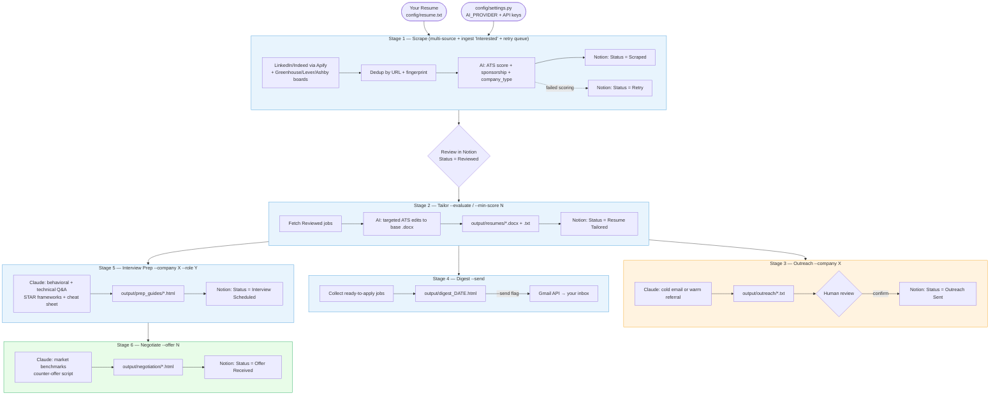

# 🤖 AI Job Search Pipeline

[](https://github.com/Iamkach/careerpilot-ai/actions)
[](https://www.python.org/downloads/)
[](#switching-ai-provider)
[](https://www.notion.so/)
[](https://github.com/Iamkach/careerpilot-ai)

Automated job search system using the Claude API — no N8N, no VPS required.
Scrapes jobs from LinkedIn, Indeed, and company Greenhouse/Lever/Ashby boards, scores
them against your resume, tailors resumes, drafts outreach, preps interviews, and
negotiates offers. Progress is tracked in **Notion** — the single source of truth.

> 📐 A full architecture deep-dive (LLD, ERD, component diagrams across three change
> horizons) lives in [`docs/architecture/`](docs/architecture/README.md) — open
> [`architecture-analysis.html`](docs/architecture/architecture-analysis.html) in a
> browser for the rendered version.

---

## Why this exists

Job searching is a pipeline problem: gather leads, filter noise, personalize per role,
track state, follow up. This project treats it that way — a **deterministic Python stage
runner** (`run.py`) drives Claude as a subroutine for scoring and writing, not as an
open-ended agent, so there's no session-window limit on how much you run.

---

## Architecture at a glance



**Provider swap:** change `AI_PROVIDER` in `config/settings.py` — `"claude"` / `"claude_code"`
/ `"gemini"` / `"codex"` / `"openrouter"`. All stages call the same `ai_chat()` dispatcher, so
no other code changes are needed. See [Switching AI provider](#switching-ai-provider).

---

## File structure

```
careerpilot-ai/
├── run.py                       # Stage runner (single entry point)
├── requirements.txt
│
├── config/
│   ├── settings.py              # API keys (env-sourced), user profile, target roles, AI models, source/filter config
│   ├── ats_tokens.json          # Cached Greenhouse/Lever/Ashby board-token discovery (auto-maintained)
│   ├── resume.txt               # Your resume (plain text, required)
│   ├── Achyuth_Resume.docx      # Master resume template (edited in-place by stage 2)
│   └── resume_template.docx     # DOCX scaffold for render_docx.py
│
├── scripts/
│   ├── utils.py                 # Shared helpers: ai_chat(), Notion-backed CRUD
│   ├── sources.py               # Source registry: LinkedIn/Indeed (Apify) + Greenhouse/Lever/Ashby, dedup, board-token discovery
│   ├── stage1_scrape.py         # Gather all ENABLED_SOURCES, ATS score + retry queue, save to Notion
│   ├── stage2_tailor.py         # Rewrite resume per JD (+ sponsorship gate + post-tailor score verification), save to output/resumes/
│   ├── stage3_outreach.py       # Draft cold/warm outreach emails
│   ├── stage4_digest.py         # Generate HTML morning digest
│   ├── stage5_interview_prep.py # Generate HTML interview prep guide
│   ├── stage6_negotiate.py      # Research salary benchmarks + negotiation script
│   ├── render_docx.py           # Extract/apply targeted docx text edits
│   ├── make_resume_template.py  # Scaffold a new DOCX template (legacy Jinja2 path)
│   └── spike_phase0_leads.py    # Step 7 spike: LinkedIn recruiter/poster lead discovery (Hunter.io) — not part of the core pipeline
│
├── output/
│   ├── resumes/                 # Tailored resumes (.docx + .txt) per job
│   ├── outreach/                # Cold/warm email drafts (.txt) — review before sending
│   ├── prep_guides/             # Interview prep guides (.html)
│   ├── negotiation/             # Negotiation briefs (.html)
│   └── digest_YYYY-MM-DD.html   # Daily digest
│
├── .github/workflows/
│   └── nightly-pipeline.yml     # Optional unattended off-hours run (hybrid AI provider routing)
│
├── docs/
│   ├── architecture/            # LLD + ERD + component-design analysis (Mermaid + self-contained HTML report)
│   ├── backlog/                 # Per-story specs for open/landed roadmap items
│   ├── refinement-plans/        # Proposed future subsystem reworks
│   ├── TODO.md                  # Open work, verified against code
│   └── CHANGELOG.md             # What's landed from the roadmap
│
└── .claude/
    ├── agents/                  # Specialized sub-agents (notion-tracker, resume-tailor, …)
    ├── commands/                # Slash commands (/scrape, /tailor, /outreach, …)
    └── skills/                  # careerpilot-ai smoke test + workflow skills
```

---

## Setup (5 minutes)

### 1. Install dependencies

```bash
pip install -r requirements.txt
```

This installs the Claude metered API client (default provider) plus the shared
dependencies (`notion-client`, `requests`, `docxtpl`). Swap in `google-generativeai`
(Gemini) or `openai` (Codex / OpenRouter) only if you change `AI_PROVIDER`.

### 2. Add your resume
Create `config/resume.txt` and paste your full resume as plain text.

### 3. Fill in config
Open `config/settings.py` and fill in. **All API keys are read from the environment**
(`os.environ.get(...)`), never as a literal in the file. Locally, copy `.env.example` to
`.env` and fill it in — `config/settings.py` loads it automatically on every run
(`.env` is git-ignored). In GitHub Actions, the same keys come from repo secrets instead
(see `.github/workflows/nightly-pipeline.yml`); `.env` has no effect there.

- `AI_PROVIDER`       — `"claude"` (default), `"claude_code"`, `"gemini"`, `"codex"`, or `"openrouter"`
- `ANTHROPIC_API_KEY` / `GEMINI_API_KEY` / `OPENAI_API_KEY` / `OPENROUTER_API_KEY` — matching your provider
- `APIFY_API_TOKEN`   — from https://apify.com (free tier) — powers the `linkedin`/`indeed` sources
- `NOTION_API_KEY`    — from https://www.notion.so/my-integrations
  - Create an integration, give it access to your Job Search Tracker database
- `HUNTER_API_KEY`    — optional, only used by the Step 7 spike script, not the core pipeline
- `ENABLED_SOURCES`   — which sources stage 1 crawls (`linkedin`, `indeed`, `greenhouse`,
  `lever`, `ashby`); the board sources are free/keyless and crawl `TARGET_COMPANIES` ∪
  every company already in Notion
- Your name, email, bio, and target roles (search is always US-wide)

See [SETUP.md](SETUP.md) for the full walkthrough, including the Notion schema and the
one-time Greenhouse/Lever/Ashby board-token discovery step.

### 4. Verify setup
```bash
python run.py --setup
```
Also prints the current `Retry` queue size (jobs whose AI scoring failed and will be
automatically re-scored on the next stage 1 run).

---

## Daily usage

The pipeline is a **two-step flow** with a human review gate in the middle.

### Step 1 — Scrape & review (each morning)
```bash
python run.py
```
Runs stages 1 + 4: scrape every enabled source, ATS-score, and produce a review digest
of new "Scraped" jobs. **Then open Notion and set `Status = Reviewed`** on the jobs you
want to apply to.

### Step 2 — Evaluate the reviewed jobs
```bash
python run.py --evaluate
```
Syncs your "Reviewed" jobs from Notion, then tailors resumes (stage 2) → drafts
outreach (stage 3) → builds the ready-to-apply digest (stage 4).

### Manually add a job (no codebase access needed)
Found a great role in your LinkedIn connections/suggestions? Add it straight in
**Notion**: create a row with **Job Title, Company, Job URL** and set
`Status = Interested`. The next `python run.py` (or `python run.py --ingest`)
enriches it via Apify, scores it, and folds it into the "Scraped" queue alongside
the auto-scraped jobs.

### Or run individual stages

| Stage | Command | What it does |
|-------|---------|--------------|
| 1 | `python run.py --stage 1` | Scrape all `ENABLED_SOURCES` (+ ingest "Interested", rescore `Retry` queue) → Notion |
| — | `python run.py --ingest` | Ingest only Notion "Interested" jobs → "Scraped" |
| 2 | `python run.py --stage 2 --min-score 60` | AI-tailor resume per Reviewed job (+ sponsorship gate) |
| 3 | `python run.py --stage 3 --company "Stripe"` | Draft cold outreach email |
| 3 | `python run.py --stage 3 --company "Google" --contact "Jane Doe"` | Draft warm referral |
| 4 | `python run.py --stage 4` | Print morning digest to terminal |
| 4 | `python run.py --stage 4 --send` | Also email digest via Gmail |
| 5 | `python run.py --stage 5 --company "Meta" --role "Senior PM"` | Interview prep guide |
| 6 | `python run.py --stage 6 --company "Stripe" --role "PM" --offer 185000` | Negotiation brief |

Every command also accepts `--ai-mode {metered,hybrid,subscription}` and
`--metered-provider {claude,codex,gemini,openrouter}` to override the AI routing for
that single run — see [Switching AI provider](#switching-ai-provider).

---

## Pipeline flow

```
Intake (manual): Notion row Status="Interested" → ingested on next scrape → "Scraped"

Stage 1: Scrape
  Gather every ENABLED_SOURCES entry (LinkedIn/Indeed via Apify + Greenhouse/Lever/Ashby
  direct JSON APIs) → collapse cross-source duplicates by company+title fingerprint →
  freshness + company/title/location/sponsorship filter → AI scores ATS match +
  sponsorship + company_type → Notion "Scraped"
  (failed scoring → Notion "Retry", auto re-scored on next run, capped by MAX_SCORING_ATTEMPTS)
                                    ↓
                  Review gate: set Status="Reviewed" in Notion

Stage 2: Tailor (--evaluate)
  "Reviewed" → sponsorship gate (holds RESTRICTED_SPONSORSHIP_COMPANIES as "Human Review") →
  AI applies targeted {old→new} ATS edits to base .docx → output/resumes/ →
  post-tailor score verification (logged) → "Resume Tailored"

Stage 3: Outreach
  "Resume Tailored" → AI drafts email → saved to output/outreach/ → "Outreach Sent"

Stage 4: Digest
  "Resume Tailored" + not applied → HTML email digest → your inbox

Stage 5: Interview Prep
  Company + JD → Claude generates full prep guide → output/prep_guides/ → Notion "Interview Scheduled"

Stage 6: Negotiate
  Company + offer → Claude researches benchmarks + writes script → output/negotiation/ → Notion "Offer Received"
```

---

## Output files

| Folder | Contents |
|--------|----------|
| `output/resumes/` | Tailored resumes per job as `.docx` (in-place edits of the base resume) + `.txt` mirror |
| `output/outreach/` | Cold + warm email drafts as `.txt` |
| `output/prep_guides/` | Interview prep as `.html` (open in browser) |
| `output/negotiation/` | Negotiation briefs as `.html` |
| `output/digest_YYYY-MM-DD.html` | Daily digest (open in browser) |

---

## Notion tracker

Status pipeline:
`Interested (manual intake) → Scraped → Reviewed → Resume Tailored → Applied → Outreach Sent → Interview Scheduled → Offer Received`

Scripts update status automatically at each stage. **You** set two of them by hand in
Notion: `Interested` (to queue a job you found) and `Reviewed` (to approve a scraped
job for tailoring).

`Retry` is a side queue, not a pipeline step — a job lands there only when its AI scoring
call fails; stage 1 automatically re-scores it (from the cached JD, no repeat Apify call)
on every subsequent run, up to `MAX_SCORING_ATTEMPTS`. You must add `Retry` as a `Status`
select option in Notion once (the API can't create select options on a write).

Five more options exist for parking a job outside the pipeline — `Disregard`, `Blacklist`,
`Archived`, `Rejected`, `Human Review`. No stage ever writes these except one exception:
stage 2's sponsorship gate moves a `Reviewed` job at a company in
`RESTRICTED_SPONSORSHIP_COMPANIES` to `Human Review` instead of tailoring it. A parked job
stops moving through the stages but still counts as a duplicate, so it won't come back on the
next scrape.

See [CLAUDE.md](CLAUDE.md) for the full property-by-property Notion schema.

---

## Gmail digest (optional)

To send the digest via email:
1. Create a Google Cloud project and enable the Gmail API
2. Download `credentials.json` and place it at `config/gmail_credentials.json`
3. Run `python run.py --stage 4 --send`

---

## Switching AI provider

Set `AI_PROVIDER` in `config/settings.py`, or override a single run with
`python run.py --ai-mode {metered,hybrid,subscription} --metered-provider {claude,codex,gemini,openrouter}`.

| `AI_PROVIDER` | Key setting | Notes |
|---|---|---|
| `"claude"` (default) | `ANTHROPIC_API_KEY` | Metered API, only path with prompt caching |
| `"claude_code"` | Claude Code subscription (`claude /login`) | Via Agent SDK, no per-call billing, shares your 5h session window |
| `"gemini"` | `GEMINI_API_KEY` | |
| `"codex"` | `OPENAI_API_KEY` | |
| `"openrouter"` | `OPENROUTER_API_KEY` | OpenAI-compatible endpoint fronting many vendors — set the model per tier in `MODEL_OVERRIDES["openrouter"]` |

`FAST_PROVIDER` / `QUALITY_PROVIDER` let you split routing per tier (fast: stage 1
scoring + stage 3 outreach; quality: stage 2 tailor + stages 5/6) — both default to
`AI_PROVIDER`, so this is a no-op unless explicitly set. See
[`.github/workflows/nightly-pipeline.yml`](.github/workflows/nightly-pipeline.yml) for the
hybrid pattern used on unattended off-hours runs.

---

## Optional: unattended nightly runs

`.github/workflows/nightly-pipeline.yml` can run the pipeline off-hours on a cron schedule
using hybrid AI provider routing (`FAST_PROVIDER=claude` metered + `QUALITY_PROVIDER=claude_code`
subscription). See [SETUP.md](SETUP.md) §6 for the required repo secrets.

---

## Tips

- Run Stage 1 daily for fresh postings (`MAX_JOB_AGE_DAYS`, default 14) — highest conversion
- Use `--min-score 65` on Stage 2 to only tailor high-match jobs
- Stage 3 outreach files need your review before sending — never auto-sent
- Prep guides open as HTML — works in any browser, no install needed
- All scripts are idempotent — safe to re-run, duplicates are skipped by URL and by
  company+title fingerprint (catches the same job posted to multiple sources)

---

## Further reading

- [`docs/architecture/README.md`](docs/architecture/README.md) — full LLD/ERD/component-design analysis, with a rendered HTML report
- [`docs/TODO.md`](docs/TODO.md) — open work, verified against code
- [`docs/CHANGELOG.md`](docs/CHANGELOG.md) — what's landed
- [`docs/backlog/`](docs/backlog/README.md) — per-story specs for roadmap items
- [`SETUP.md`](SETUP.md) — full setup walkthrough
- [`CLAUDE.md`](CLAUDE.md) — architecture reference for Claude Code / contributors
