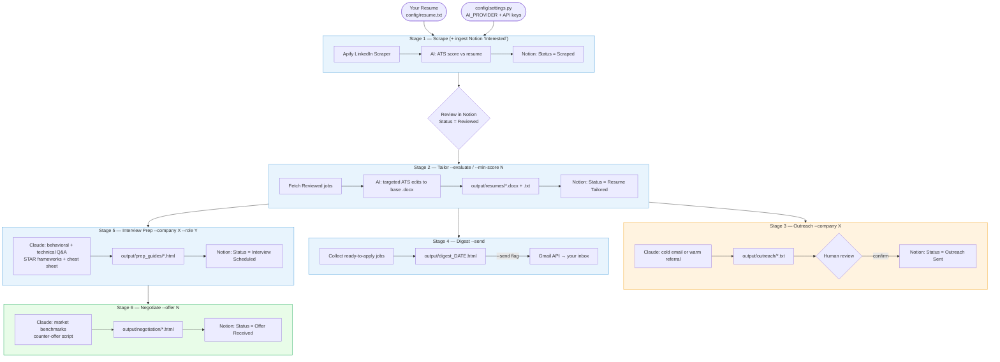

# 🤖 AI Job Search Pipeline

Automated job search system using Claude API — no N8N, no VPS required.
Scrapes LinkedIn, tailors resumes, drafts outreach, preps interviews, and negotiates offers.
Progress is tracked in **Notion** (the single source of truth — the job tracker database).

---

## Workflow



**Provider swap:** change `AI_PROVIDER` in `config/settings.py` to `"claude"` / `"gemini"` / `"codex"` — all stages use the same `ai_chat()` dispatcher with no other changes needed.

---

## File structure

```
local-n8n-engine/
├── workflow.py                  # Claude-native agentic orchestrator (preferred)
├── run.py                       # Legacy stage runner
├── requirements.txt
│
├── config/
│   ├── settings.py              # API keys, user profile, target roles, AI models
│   ├── resume.txt               # Your resume (plain text, required)
│   ├── Achyuth_Resume.docx      # Master resume template (edited in-place by stage 2)
│   └── resume_template.docx     # DOCX scaffold for render_docx.py
│
├── scripts/
│   ├── utils.py                 # Shared helpers: ai_chat(), Notion-backed CRUD
│   ├── stage1_scrape.py         # Scrape LinkedIn via Apify, ATS score, save to Notion
│   ├── stage2_tailor.py         # Rewrite resume per JD, save to output/resumes/
│   ├── stage3_outreach.py       # Draft cold/warm outreach emails
│   ├── stage4_digest.py         # Generate HTML morning digest
│   ├── stage5_interview_prep.py # Generate HTML interview prep guide
│   ├── stage6_negotiate.py      # Research salary benchmarks + negotiation script
│   ├── render_docx.py           # Render tailored resume as .docx
│   └── make_resume_template.py  # Scaffold a new DOCX template
│
├── output/
│   ├── resumes/                 # Tailored resumes (.docx + .txt) per job
│   ├── outreach/                # Cold/warm email drafts (.txt) — review before sending
│   ├── prep_guides/             # Interview prep guides (.html)
│   ├── negotiation/             # Negotiation briefs (.html)
│   └── digest_YYYY-MM-DD.html   # Daily digest
│
└── .claude/
    ├── agents/                  # Specialized sub-agents (notion-tracker, resume-tailor, …)
    ├── commands/                # Slash commands (/scrape, /tailor, /outreach, …)
    └── skills/                  # run-local-n8n-engine smoke test skill
```

---

## Setup (5 minutes)

### 1. Install dependencies

Install the SDK for your chosen AI provider plus the shared dependencies:

```bash
# Claude Code subscription (default provider: claude_code)
pip install claude-agent-sdk notion-client requests docxtpl

# Gemini
pip install google-generativeai notion-client requests docxtpl

# OpenAI / Codex
pip install openai notion-client requests docxtpl
```

> `notion-client` is the primary data store (required); `docxtpl` backs the stage-2 `.docx`
> resumes. Or just `pip install -r requirements.txt`.

### 2. Add your resume
Create `config/resume.txt` and paste your full resume as plain text.

### 3. Fill in config
Open `config/settings.py` and fill in:
- `AI_PROVIDER`       — `"claude"` (default), `"gemini"`, or `"codex"`
- `ANTHROPIC_API_KEY` / `GEMINI_API_KEY` / `OPENAI_API_KEY` — matching your provider
- `APIFY_API_TOKEN`   — from https://apify.com (free)
- `NOTION_API_KEY`    — from https://www.notion.so/my-integrations
  - Create an integration, give it access to your Job Search Tracker database
- Your name, email, bio, target roles, and city

### 4. Verify setup
```bash
python run.py --setup
```

---

## Daily usage

The pipeline is a **two-step flow** with a human review gate in the middle.

### Step 1 — Scrape & review (each morning)
```bash
python run.py
```
Runs stages 1 + 4: scrape LinkedIn, ATS-score, and produce a review digest of new
"Scraped" jobs. **Then open Notion and set `Status = Reviewed`** on the jobs you want
to apply to.

### Step 2 — Evaluate the reviewed jobs
```bash
python run.py --evaluate
```
Syncs your "Reviewed" jobs from Notion, then tailors resumes (stage 2) → drafts
outreach (stage 3) → builds the ready-to-apply digest (stage 4).

### Manually add a job (no codebase access needed)
Found a great role in your LinkedIn connections/suggestions? Add it straight in
**Notion**: create a row with **Job Title, Company, Job URL** and set
`Status = Interested`. The next `python run.py` (or `python run.py --ingest`)
enriches it via Apify, scores it, and folds it into the "Scraped" queue alongside
the auto-scraped jobs.

### Or run individual stages

| Stage | Command | What it does |
|-------|---------|--------------|
| 1 | `python run.py --stage 1` | Scrape fresh LinkedIn jobs (+ ingest "Interested") → Notion |
| — | `python run.py --ingest` | Ingest only Notion "Interested" jobs → "Scraped" |
| 2 | `python run.py --stage 2 --min-score 60` | AI-tailor resume per Reviewed job |
| 3 | `python run.py --stage 3 --company "Stripe"` | Draft cold outreach email |
| 3 | `python run.py --stage 3 --company "Google" --contact "Jane Doe"` | Draft warm referral |
| 4 | `python run.py --stage 4` | Print morning digest to terminal |
| 4 | `python run.py --stage 4 --send` | Also email digest via Gmail |
| 5 | `python run.py --stage 5 --company "Meta" --role "Senior PM"` | Interview prep guide |
| 6 | `python run.py --stage 6 --company "Stripe" --role "PM" --offer 185000` | Negotiation brief |

---

## Pipeline flow

```
Intake (manual): Notion row Status="Interested" → ingested on next scrape → "Scraped"

Stage 1: Scrape
  LinkedIn (via Apify) → AI scores ATS match → Notion "Scraped"
                                    ↓
                  Review gate: set Status="Reviewed" in Notion

Stage 2: Tailor (--evaluate)
  "Reviewed" → AI applies ATS edits to base .docx → output/resumes/ → "Resume Tailored"

Stage 3: Outreach
  "Resume Tailored" → AI drafts email → saved to output/outreach/ → "Outreach Sent"

Stage 4: Digest
  "Resume Tailored" + not applied → HTML email digest → your inbox

Stage 5: Interview Prep
  Company + JD → Claude generates full prep guide → output/prep_guides/ → Notion "Interview Scheduled"

Stage 6: Negotiate
  Company + offer → Claude researches benchmarks + writes script → output/negotiation/ → Notion "Offer Received"
```

---

## Output files

| Folder | Contents |
|--------|----------|
| `output/resumes/` | Tailored resumes per job as `.docx` (in-place edits of the base resume) + `.txt` mirror |
| `output/outreach/` | Cold + warm email drafts as `.txt` |
| `output/prep_guides/` | Interview prep as `.html` (open in browser) |
| `output/negotiation/` | Negotiation briefs as `.html` |
| `output/digest_YYYY-MM-DD.html` | Daily digest (open in browser) |

---

## Notion tracker

Your tracker is already live:
https://www.notion.so/2ac0907e693744698a1c748d37774a07

Status pipeline:
`Interested (manual intake) → Scraped → Reviewed → Resume Tailored → Applied → Outreach Sent → Interview Scheduled → Offer Received`

Scripts update status automatically at each stage. **You** set two of them by hand in
Notion: `Interested` (to queue a job you found) and `Reviewed` (to approve a scraped
job for tailoring).

---

## Gmail digest (optional)

To send the digest via email:
1. Create a Google Cloud project and enable the Gmail API
2. Download `credentials.json` and place it at `config/gmail_credentials.json`
3. Run `python run.py --stage 4 --send`

---

## Tips

- Run Stage 1 daily for fresh <24h postings (highest conversion)
- Use `--min-score 65` on Stage 2 to only tailor high-match jobs
- Stage 3 outreach files need your review before sending — never auto-sent
- Prep guides open as HTML — works in any browser, no install needed
- All scripts are idempotent — safe to re-run, duplicates are skipped
