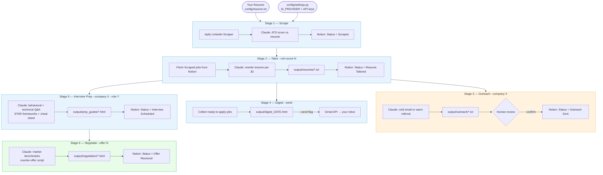

# 🤖 AI Job Search Pipeline

Automated job search system using Claude API — no N8N, no VPS required.
Scrapes LinkedIn, tailors resumes, drafts outreach, preps interviews, and negotiates offers.
All tracked in your Notion database.

---

## Workflow



**Provider swap:** change `AI_PROVIDER` in `config/settings.py` to `"claude"` / `"gemini"` / `"codex"` — all stages use the same `ai_chat()` dispatcher with no other changes needed.

---

## Setup (5 minutes)

### 1. Install dependencies

Install the SDK for your chosen AI provider plus the shared dependencies:

```bash
# Claude (default)
pip install anthropic notion-client requests

# Gemini
pip install google-generativeai notion-client requests

# OpenAI / Codex
pip install openai notion-client requests
```

### 2. Add your resume
Create `config/resume.txt` and paste your full resume as plain text.

### 3. Fill in config
Open `config/settings.py` and fill in:
- `AI_PROVIDER`       — `"claude"` (default), `"gemini"`, or `"codex"`
- `ANTHROPIC_API_KEY` / `GEMINI_API_KEY` / `OPENAI_API_KEY` — matching your provider
- `APIFY_API_TOKEN`   — from https://apify.com (free)
- `NOTION_API_KEY`    — from https://www.notion.so/my-integrations
  - Create an integration, give it access to your Job Search Tracker database
- Your name, email, bio, target roles, and city

### 4. Verify setup
```bash
python run.py --setup
```

---

## Daily usage

### Morning routine (run all at once)
```bash
python run.py
```
This runs: Scrape → Tailor resumes → Send digest

### Or run individual stages

| Stage | Command | What it does |
|-------|---------|--------------|
| 1 | `python run.py --stage 1` | Scrape fresh LinkedIn jobs → Notion |
| 2 | `python run.py --stage 2 --min-score 60` | AI-tailor resume per job |
| 3 | `python run.py --stage 3 --company "Stripe"` | Draft cold outreach email |
| 3 | `python run.py --stage 3 --company "Google" --contact "Jane Doe"` | Draft warm referral |
| 4 | `python run.py --stage 4` | Print morning digest to terminal |
| 4 | `python run.py --stage 4 --send` | Also email digest via Gmail |
| 5 | `python run.py --stage 5 --company "Meta" --role "Senior PM"` | Interview prep guide |
| 6 | `python run.py --stage 6 --company "Stripe" --role "PM" --offer 185000` | Negotiation brief |

---

## Pipeline flow

```
Stage 1: Scrape
  LinkedIn (via Apify) → Claude scores ATS match → Notion "Scraped"

Stage 2: Tailor
  Notion "Scraped" → Claude rewrites resume → saved to output/resumes/ → Notion "Resume Tailored"

Stage 3: Outreach
  Notion "Resume Tailored" → Claude drafts email → saved to output/outreach/ → Notion "Outreach Sent"

Stage 4: Digest
  Notion "Resume Tailored" + not applied → HTML email digest → your inbox

Stage 5: Interview Prep
  Company + JD → Claude generates full prep guide → output/prep_guides/ → Notion "Interview Scheduled"

Stage 6: Negotiate
  Company + offer → Claude researches benchmarks + writes script → output/negotiation/ → Notion "Offer Received"
```

---

## Output files

| Folder | Contents |
|--------|----------|
| `output/resumes/` | Tailored resumes per job as `.txt` |
| `output/outreach/` | Cold + warm email drafts as `.txt` |
| `output/prep_guides/` | Interview prep as `.html` (open in browser) |
| `output/negotiation/` | Negotiation briefs as `.html` |
| `output/digest_YYYY-MM-DD.html` | Daily digest (open in browser) |

---

## Notion tracker

Your tracker is already live:
https://www.notion.so/2ac0907e693744698a1c748d37774a07

Status pipeline:
`Scraped → Resume Tailored → Applied → Outreach Sent → Interview Scheduled → Offer Received`

Scripts update status automatically at each stage.

---

## Gmail digest (optional)

To send the digest via email:
1. Create a Google Cloud project and enable the Gmail API
2. Download `credentials.json` and place it at `config/gmail_credentials.json`
3. Run `python run.py --stage 4 --send`

---

## Tips

- Run Stage 1 daily for fresh <24h postings (highest conversion)
- Use `--min-score 65` on Stage 2 to only tailor high-match jobs
- Stage 3 outreach files need your review before sending — never auto-sent
- Prep guides open as HTML — works in any browser, no install needed
- All scripts are idempotent — safe to re-run, duplicates are skipped
