# AI Job Search Pipeline — Architecture Analysis

### Low-Level Design · Entity-Relationship Model · Component Design

**Across three change horizons:** `main` (current baseline) → `feat/maverick` (advancements) → `refinement-plans/` (proposed future)

| | |
|---|---|
| **Document type** | Technical LLD + ERD + component design, with a project-management roadmap view |
| **Prepared by** | Multi-agent code analysis (three parallel deep reads: baseline, delta, future) |
| **Baseline commits** | `main` @ `e2014d1` · `feat/maverick` @ `23949fe` (20 commits ahead of `main`) |
| **Verification** | Every structural claim traced to `file:line` in source; unverified/conflicting items are flagged explicitly |
| **Diagram engine** | Mermaid (renders in GitHub, GitLab, Confluence [Mermaid macro], Notion code blocks, VS Code, and the companion HTML) |

> **How to read / export this document**
> - **View with diagrams:** open `architecture-analysis.html` (same folder) in any browser — all diagrams render inline.
> - **Export to PDF:** open that HTML → `Ctrl/Cmd + P` → *Save as PDF* (print styles and page breaks are included).
> - **Import to Confluence / Notion:** paste this `.md`; both render Mermaid fenced blocks (Confluence via the *Mermaid* macro, Notion via a `mermaid` code block).

---

## 0. How to read the diagrams (legend & conventions)

Every diagram in this document uses a consistent visual language so the three horizons can be compared at a glance.

| Convention | Meaning |
|---|---|
| 🟦 **Blue** nodes/tags | Belongs to / unchanged on `main` (baseline) |
| 🟪 **Purple** nodes/tags | Introduced or materially changed by `feat/maverick` |
| 🟩 **Green** nodes/tags | Proposed by `refinement-plans/` (not yet implemented) |
| **Cylinder** `[( )]` | A datastore (Supabase table, Notion database, JSON cache) |
| **Rounded** `([ ])` | An input artifact (resume, config) or terminal |
| **Diamond** `{ }` | A decision / gate (human review, filter, routing) |
| **Rectangle** `[ ]` | A process / component / stage |
| ⚠️ callouts | A confirmed defect or risk, cited to `file:line` |

Diagram classes used per horizon: **System context** (who talks to whom), **Component/container** (internal modules & dependencies), **ERD** (entities, attributes, relationships), **Pipeline flow** (end-to-end LLD), **Sequence** (ordered stage interactions), **State machine** (job lifecycle), plus a **Roadmap DAG** and **Gantt** for the future plans.

---

## 1. Executive summary

The pipeline is a Python job-search automation that scrapes listings, scores them against a résumé (ATS 0–100), tailors résumés, drafts outreach, and produces digests / interview-prep / negotiation briefs. It has **two entry points over one set of stage scripts**: `run.py` (deterministic — Python sequences the stages) and `workflow.py` (agentic — an LLM decides which stage runs). What changes across the three horizons is *not the mission* but **where data lives, how the orchestrator is built, how jobs are sourced, and how failures are handled.**

The evolution is best understood as **two migrations already delivered on `feat/maverick`, and four subsystem reworks still proposed:**

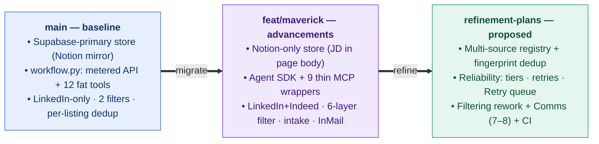
```mermaid
flowchart LR
    M["<b>main — baseline</b><br/>• Supabase-primary store (Notion mirror)<br/>• workflow.py: metered API + 12 fat tools<br/>• LinkedIn-only · 2 filters · per-listing dedup"]
    V["<b>feat/maverick — advancements</b><br/>• Notion-only store (JD in page body)<br/>• Agent SDK + 9 thin MCP wrappers<br/>• LinkedIn+Indeed · 6-layer filter · intake · InMail"]
    F["<b>refinement-plans — proposed</b><br/>• Multi-source registry + fingerprint dedup<br/>• Reliability: tiers · retries · Retry queue<br/>• Filtering rework + Comms (7–8) + CI"]
    M ==>|"migrate"| V ==>|"refine"| F

    classDef main fill:#e7effd,stroke:#2f6fed,color:#12336e;
    classDef mav fill:#f0e8fd,stroke:#7b3fe4,color:#3d1a80;
    classDef fut fill:#e5f6ee,stroke:#1f9d6b,color:#0d5236;
    class M main;
    class V mav;
    class F fut;
```

### 1.1 Capability matrix across horizons

| Dimension | `main` (baseline) | `feat/maverick` (advancements) | `refinement-plans` (proposed) |
|---|---|---|---|
| **Source of truth** | Supabase `jobs` table | **Notion** (Supabase removed) | Notion (Jobs DB + **new Leads DB**) |
| **Job description stored in** | Supabase `job_description` column | **Notion page body** (paragraph blocks) | Notion page body (unchanged) |
| **Orchestrator (`workflow.py`)** | Metered Anthropic API + 12 hand-rolled tools | **Agent SDK + 9 thin MCP wrappers** delegating to stages | + `run_leads_discover` / `run_email_resolve` tools |
| **Default AI transport** | `AI_PROVIDER="codex"` (OpenAI); workflow hardwired to metered Anthropic | **`claude_code`** (subscription via Agent SDK) | Tiered: `claude_code` (quality) + metered Haiku (fast) |
| **Sources** | LinkedIn only (`curious_coder`) | LinkedIn (`bebity`) + Indeed (`bebity`, **404/dead**) | LinkedIn (`valig`) + Indeed (`misceres`) + Greenhouse/Lever/Ashby + JobSpy |
| **Stage-1 filtering** | 2 filters (company substring, US) + post-score sponsorship | **6-layer pre-filter** + drop logs | Word-boundary company match + AI `company_type` + head/tail JD excerpt |
| **De-duplication** | Per-listing `db_find_job_by_url` | **One in-memory snapshot** (`db_get_all_jobs`) | + cross-source **fingerprint** dedup (ATS copy wins) |
| **Manual "Interested" intake** | ✗ absent | ✓ `ingest` (but self-match bug) | intake fixed (`exclude_page_id`) |
| **Failure handling on scoring** | Fabricated `score=50` | Fabricated `score=50` (unchanged) | **`Retry` status + capped re-score queue**, typed errors, metered failover |
| **Outreach** | Cold / warm email | + LinkedIn **InMail** (orphaned) | + **verified cold email** (Hunter) + LinkedIn leads (Stages 7–8) |
| **Execution model** | Local, manual | Local, manual | + **GitHub Actions** cron (forces provider split) |
| **Notion `Status` options** | 7 (in workflow enum) | 13 (9 in `_STATUSES`) | +1 (`Retry` / `Needs Review` — unresolved) |

### 1.2 Headline findings

1. **Two real architectural migrations are already on `feat/maverick`**, not just features: a **datastore migration** (Supabase-primary → Notion-only, with the JD relocating from a table column into the page body) and an **orchestrator rebuild** (metered Anthropic + fat re-implemented tools → Agent SDK + thin wrappers that delegate to the single stage implementation — the "no-drift" principle).
2. **The refinement plans are internally sequenced and conflicting** — five documents that overlap on the same four functions. The `refinement-plans/README.md` already resolves this into a strict `Step 0 → 7` spine with eight named conflicts (C1–C8); this document renders that as a dependency DAG and Gantt.
3. **Several confirmed defects span horizons** — a dead Indeed actor that silently returns zero, a LinkedIn payload/actor mismatch, an "Interested" self-match bug, an orphaned InMail feature, collected-but-never-persisted fields, and plaintext secrets in VCS. Each is cited inline and collected in the §5 risk register.

---

# A. Current state — `main` (baseline) 

> **Orientation:** On `main`, **Supabase is the primary datastore** and Notion is an *optional visual mirror*. The JD is a Supabase column. `workflow.py` talks to the **metered Anthropic API** directly (no Agent SDK, no MCP), and re-implements scraping/scoring inside its own tools. There is **no** "Interested" intake, **no** `--ingest`, and **no** in-memory dedup — those arrive on `feat/maverick`.

## A.1 System context

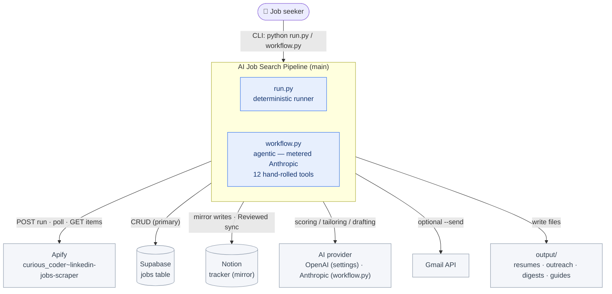
```mermaid
flowchart TB
    User(["👤 Job seeker"]) -->|"CLI: python run.py / workflow.py"| SYS
    subgraph SYS["AI Job Search Pipeline (main)"]
      RP["run.py<br/>deterministic runner"]
      WF["workflow.py<br/>agentic — metered Anthropic<br/>12 hand-rolled tools"]
    end
    SYS -->|"POST run · poll · GET items"| APIFY["Apify<br/>curious_coder~linkedin-jobs-scraper"]
    SYS -->|"CRUD (primary)"| SUPA[("Supabase<br/>jobs table")]
    SYS -->|"mirror writes · Reviewed sync"| NOTION[("Notion<br/>tracker (mirror)")]
    SYS -->|"scoring / tailoring / drafting"| AI["AI provider<br/>OpenAI (settings) · Anthropic (workflow.py)"]
    SYS -->|"optional --send"| GMAIL["Gmail API"]
    SYS -->|"write files"| OUT["output/<br/>resumes · outreach · digests · guides"]

    classDef sys fill:#e7effd,stroke:#2f6fed,color:#12336e;
    classDef ext fill:#f4f6fa,stroke:#8a97a8,color:#33404f;
    class RP,WF sys;
    class APIFY,SUPA,NOTION,AI,GMAIL,OUT ext;
```

⚠️ **Two entry points diverge.** `workflow.py`'s `_impl_scrape_linkedin_jobs` (`workflow.py:50`) applies **none** of Stage 1's `SKIP_COMPANIES` / US-location / sponsorship filters, and sets `date_applied` at tailor time (`workflow.py:171`) while `db_get_ready_to_apply` filters `date_applied is null` (`utils.py:310`) — so jobs tailored via the agentic path are silently excluded from the digest.

## A.2 Component / container diagram

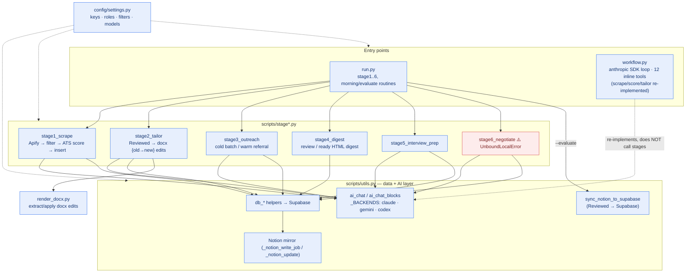
```mermaid
flowchart TB
    subgraph ENTRY["Entry points"]
      RP["run.py<br/>stage1..6, morning/evaluate routines"]
      WF["workflow.py<br/>anthropic SDK loop · 12 inline tools<br/>(scrape/score/tailor re-implemented)"]
    end
    subgraph STAGES["scripts/stage*.py"]
      S1["stage1_scrape<br/>Apify → filter → ATS score → insert"]
      S2["stage2_tailor<br/>Reviewed → docx {old→new} edits"]
      S3["stage3_outreach<br/>cold batch / warm referral"]
      S4["stage4_digest<br/>review / ready HTML digest"]
      S5["stage5_interview_prep"]
      S6["stage6_negotiate ⚠️ UnboundLocalError"]
    end
    subgraph UTIL["scripts/utils.py — data + AI layer"]
      DBS["db_* helpers → Supabase"]
      NM["Notion mirror (_notion_write_job / _notion_update)"]
      SYNC["sync_notion_to_supabase<br/>(Reviewed → Supabase)"]
      AIB["ai_chat / ai_chat_blocks<br/>_BACKENDS: claude · gemini · codex"]
    end
    DOCX["render_docx.py<br/>extract/apply docx edits"]
    CFG["config/settings.py<br/>keys · roles · filters · models"]

    RP --> S1 & S2 & S3 & S4 & S5 & S6
    WF -.->|"re-implements, does NOT call stages"| AIB
    S1 --> AIB & DBS
    S2 --> AIB & DBS & DOCX
    S3 --> AIB & DBS
    S4 --> DBS
    S5 --> AIB & DBS
    S6 --> AIB & DBS
    DBS --> NM
    RP -->|"--evaluate"| SYNC
    CFG -.-> UTIL & STAGES & ENTRY

    classDef main fill:#e7effd,stroke:#2f6fed,color:#12336e;
    classDef warn fill:#fdecec,stroke:#d64545,color:#7a1d1d;
    class RP,WF,S1,S2,S3,S4,S5,DBS,NM,SYNC,AIB,DOCX,CFG main;
    class S6 warn;
```

## A.3 Entity-Relationship Diagram (Supabase-primary)

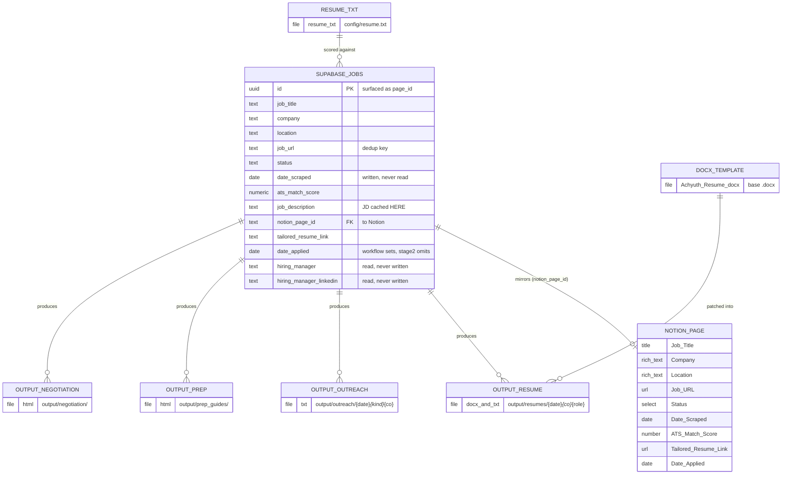
```mermaid
erDiagram
    SUPABASE_JOBS ||--o| NOTION_PAGE : "mirrors (notion_page_id)"
    SUPABASE_JOBS ||--o{ OUTPUT_RESUME : "produces"
    SUPABASE_JOBS ||--o{ OUTPUT_OUTREACH : "produces"
    SUPABASE_JOBS ||--o{ OUTPUT_PREP : "produces"
    SUPABASE_JOBS ||--o{ OUTPUT_NEGOTIATION : "produces"
    RESUME_TXT ||--o{ SUPABASE_JOBS : "scored against"
    DOCX_TEMPLATE ||--o{ OUTPUT_RESUME : "patched into"

    SUPABASE_JOBS {
        uuid id PK "surfaced as page_id"
        text job_title
        text company
        text location
        text job_url "dedup key"
        text status
        date date_scraped "written, never read"
        numeric ats_match_score
        text job_description "JD cached HERE"
        text notion_page_id FK "to Notion"
        text tailored_resume_link
        date date_applied "workflow sets, stage2 omits"
        text hiring_manager "read, never written"
        text hiring_manager_linkedin "read, never written"
    }
    NOTION_PAGE {
        title Job_Title
        rich_text Company
        rich_text Location
        url Job_URL
        select Status
        date Date_Scraped
        number ATS_Match_Score
        url Tailored_Resume_Link
        date Date_Applied
    }
    RESUME_TXT {
        file resume_txt "config/resume.txt"
    }
    DOCX_TEMPLATE {
        file Achyuth_Resume_docx "base .docx"
    }
    OUTPUT_RESUME {
        file docx_and_txt "output/resumes/{date}_{co}_{role}"
    }
    OUTPUT_OUTREACH {
        file txt "output/outreach/{date}_{kind}_{co}"
    }
    OUTPUT_PREP {
        file html "output/prep_guides/"
    }
    OUTPUT_NEGOTIATION {
        file html "output/negotiation/"
    }
```

**ERD notes:** the JD lives in the **Supabase `job_description` column** (not Notion). `missing_keywords` is computed in scoring but has no column and is dropped; `hiring_manager*` are read by `db_get_job_by_company` but no stage writes them; `TARGET_COMPANIES` and `GDRIVE_RESUME_ID` are defined in settings but referenced nowhere.

## A.4 End-to-end pipeline flow (LLD)

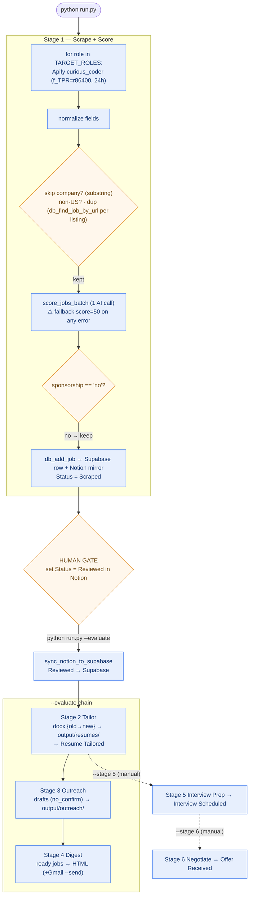
```mermaid
flowchart TD
    START(["python run.py"]) --> S1
    subgraph S1["Stage 1 — Scrape + Score"]
      A1["for role in TARGET_ROLES:<br/>Apify curious_coder (f_TPR=r86400, 24h)"] --> A2["normalize fields"]
      A2 --> A3{"skip company? (substring)<br/>non-US? · dup (db_find_job_by_url per listing)"}
      A3 -->|"kept"| A4["score_jobs_batch (1 AI call)<br/>⚠️ fallback score=50 on any error"]
      A4 --> A5{"sponsorship == 'no'?"}
      A5 -->|"no → keep"| A6["db_add_job → Supabase row + Notion mirror<br/>Status = Scraped"]
    end
    A6 --> GATE{"HUMAN GATE<br/>set Status = Reviewed in Notion"}
    GATE -->|"python run.py --evaluate"| SYNC["sync_notion_to_supabase<br/>Reviewed → Supabase"]
    SYNC --> S2
    subgraph EVAL["--evaluate chain"]
      S2["Stage 2 Tailor<br/>docx {old→new} → output/resumes/<br/>→ Resume Tailored"] --> S3["Stage 3 Outreach<br/>drafts (no_confirm) → output/outreach/"]
      S3 --> S4["Stage 4 Digest<br/>ready jobs → HTML (+Gmail --send)"]
    end
    S2 -.->|"--stage 5 (manual)"| S5["Stage 5 Interview Prep → Interview Scheduled"]
    S5 -.->|"--stage 6 (manual)"| S6["Stage 6 Negotiate → Offer Received"]

    classDef main fill:#e7effd,stroke:#2f6fed,color:#12336e;
    classDef gate fill:#fff7ec,stroke:#e08a1e,color:#6b4410;
    class A1,A2,A4,A6,S2,S3,S4,S5,S6,SYNC main;
    class A3,A5,GATE gate;
```

## A.5 Sequence — Stage 1 scrape & score

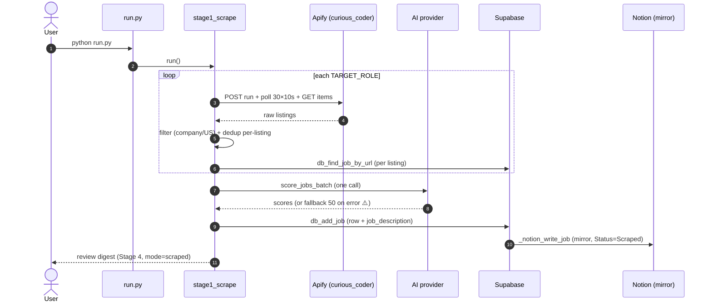
```mermaid
sequenceDiagram
    autonumber
    actor U as User
    participant R as run.py
    participant S1 as stage1_scrape
    participant AP as Apify (curious_coder)
    participant AI as AI provider
    participant DB as Supabase
    participant NO as Notion (mirror)
    U->>R: python run.py
    R->>S1: run()
    loop each TARGET_ROLE
      S1->>AP: POST run + poll 30×10s + GET items
      AP-->>S1: raw listings
      S1->>S1: filter (company/US) + dedup per-listing
      S1->>DB: db_find_job_by_url (per listing)
    end
    S1->>AI: score_jobs_batch (one call)
    AI-->>S1: scores (or fallback 50 on error ⚠️)
    S1->>DB: db_add_job (row + job_description)
    DB->>NO: _notion_write_job (mirror, Status=Scraped)
    S1-->>U: review digest (Stage 4, mode=scraped)
```

## A.6 Sequence — Evaluate (tailor → outreach → digest)

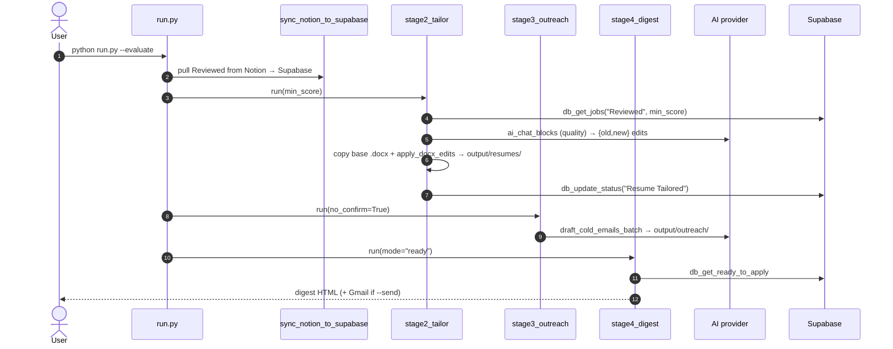
```mermaid
sequenceDiagram
    autonumber
    actor U as User
    participant R as run.py
    participant SY as sync_notion_to_supabase
    participant S2 as stage2_tailor
    participant S3 as stage3_outreach
    participant S4 as stage4_digest
    participant AI as AI provider
    participant DB as Supabase
    U->>R: python run.py --evaluate
    R->>SY: pull Reviewed from Notion → Supabase
    R->>S2: run(min_score)
    S2->>DB: db_get_jobs("Reviewed", min_score)
    S2->>AI: ai_chat_blocks (quality) → {old,new} edits
    S2->>S2: copy base .docx + apply_docx_edits → output/resumes/
    S2->>DB: db_update_status("Resume Tailored")
    R->>S3: run(no_confirm=True)
    S3->>AI: draft_cold_emails_batch → output/outreach/
    R->>S4: run(mode="ready")
    S4->>DB: db_get_ready_to_apply
    S4-->>U: digest HTML (+ Gmail if --send)
```

## A.7 Job status lifecycle (state machine)

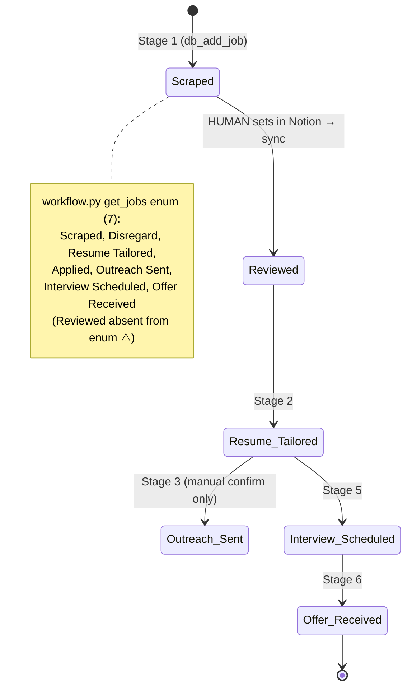
```mermaid
stateDiagram-v2
    [*] --> Scraped: Stage 1 (db_add_job)
    Scraped --> Reviewed: HUMAN sets in Notion → sync
    Reviewed --> Resume_Tailored: Stage 2
    Resume_Tailored --> Outreach_Sent: Stage 3 (manual confirm only)
    Resume_Tailored --> Interview_Scheduled: Stage 5
    Interview_Scheduled --> Offer_Received: Stage 6
    Offer_Received --> [*]
    note right of Scraped
      workflow.py get_jobs enum (7):
      Scraped, Disregard, Resume Tailored,
      Applied, Outreach Sent,
      Interview Scheduled, Offer Received
      (Reviewed absent from enum ⚠️)
    end note
```

## A.8 Notable baseline defects (cited)

| # | Defect | Location | Effect |
|---|---|---|---|
| B1 | `job` used before assignment in Stage 6 | `stage6_negotiate.py:125` vs `:135` | `UnboundLocalError` on **every** Stage 6 run |
| B2 | `date_applied` set at tailor time by workflow but filtered as `is null` | `workflow.py:171` vs `utils.py:310` | Agentic-tailored jobs vanish from the ready digest |
| B3 | Agentic scrape skips all Stage-1 filters | `workflow.py:50` | Same task, materially different results per entry point |
| B4 | `get_jobs` enum omits `Reviewed` yet evaluate asks for it | `workflow.py:337-340` vs `:541` | Schema/prompt mismatch |
| B5 | Stage 5 asks the LLM to "fetch" a URL it can't access | `stage5:141,146` | Hallucinated JD when no cached JD exists |
| B6 | Committed secrets (Anthropic, OpenAI, Apify, Notion, Supabase **service_role**) | `settings.py:62-73` | Credential exposure in VCS |
| B7 | Stale docstrings claim "Notion" store while code is Supabase-primary | `stage1:5-11` et al. | Misleads maintainers |

---

# B. Advancements — `feat/maverick` (delta vs `main`) 

> **20 commits ahead of `main`; 28 files, +3,895 / −1,292.** The headline is a **store migration (Supabase → Notion-only)** and an **orchestrator rebuild (fat metered tools → thin Agent-SDK MCP wrappers).**

## B.1 What changed at a glance

| Component | `main` did | `feat/maverick` does |
|---|---|---|
| **Datastore** | Supabase `jobs` table (primary) + Notion mirror | **Notion only** — Supabase deleted; JD cached in **page body** |
| **`workflow.py`** | Metered `anthropic` loop; 12 fat tools re-implement scrape/score/tailor | **`claude-agent-sdk` `query()`; 9 thin `mcp__jobpipe__*` wrappers delegate to stage `run()`** |
| **AI transport** | `AI_PROVIDER="codex"`; workflow hardwired to Anthropic | **`claude_code`** default (subscription); `STAGE_AI_PROVIDER` split; `ANTHROPIC_API_KEY` popped |
| **`stage1_scrape`** | LinkedIn-only, 2 filters, per-listing dedup | **LinkedIn+Indeed, 6-layer pre-filter, snapshot dedup, Interested intake, Premium signals** |
| **`stage2_tailor`** | Per-job simple prompt | **Batched single call + per-job fallback**, 4-priority structured prompt |
| **`stage3_outreach`** | Cold / warm email | **+ LinkedIn InMail** (`run_inmail`) — *orphaned, unreachable from entry points ⚠️* |
| **`utils.py`** | Supabase `_get_db()` | **Notion `_query_db()`**; `claude_code` backend; `db_get_all_jobs`, `db_add_job_linked`, JD-in-body helpers |
| **`requirements.txt`** | `supabase` primary | **`claude-agent-sdk` added; `supabase` removed; `notion-client` pinned `<2.6`** |

## B.2 Component / container diagram (Notion-primary + thin MCP)

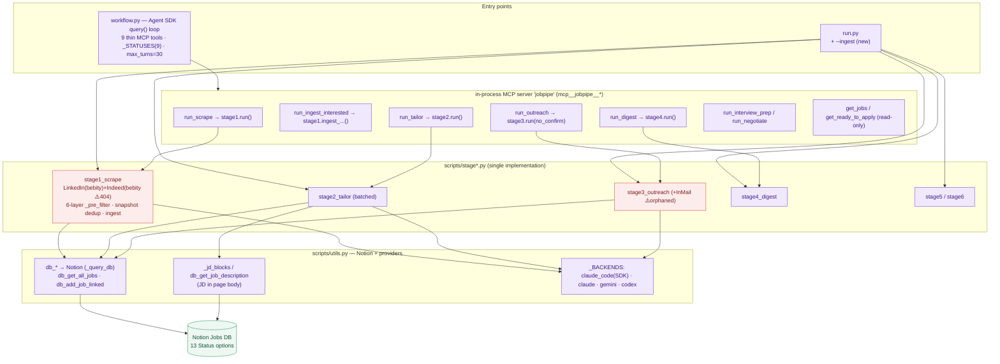
```mermaid
flowchart TB
    subgraph ENTRY["Entry points"]
      RP["run.py<br/>+ --ingest (new)"]
      WF["workflow.py — Agent SDK query() loop<br/>9 thin MCP tools · _STATUSES(9) · max_turns=30"]
    end
    subgraph MCP["in-process MCP server 'jobpipe' (mcp__jobpipe__*)"]
      T1["run_scrape → stage1.run()"]
      T2["run_ingest_interested → stage1.ingest_...()"]
      T3["run_tailor → stage2.run()"]
      T4["run_outreach → stage3.run(no_confirm)"]
      T5["run_digest → stage4.run()"]
      T6["run_interview_prep / run_negotiate"]
      T7["get_jobs / get_ready_to_apply (read-only)"]
    end
    subgraph STAGES["scripts/stage*.py (single implementation)"]
      S1["stage1_scrape<br/>LinkedIn(bebity)+Indeed(bebity ⚠️404)<br/>6-layer _pre_filter · snapshot dedup · ingest"]
      S2["stage2_tailor (batched)"]
      S3["stage3_outreach (+InMail ⚠️orphaned)"]
      S4["stage4_digest"]
      S56["stage5 / stage6"]
    end
    subgraph UTIL["scripts/utils.py — Notion + providers"]
      DBN["db_* → Notion (_query_db)<br/>db_get_all_jobs · db_add_job_linked"]
      JDB["_jd_blocks / db_get_job_description<br/>(JD in page body)"]
      BK["_BACKENDS: claude_code(SDK) · claude · gemini · codex"]
    end
    NOTION[("Notion Jobs DB<br/>13 Status options")]
    RP --> S1 & S2 & S3 & S4 & S56
    WF --> MCP
    T1 --> S1
    T3 --> S2
    T4 --> S3
    T5 --> S4
    S1 --> BK & DBN
    S2 --> BK & DBN & JDB
    S3 --> BK & DBN
    DBN --> NOTION
    JDB --> NOTION

    classDef mav fill:#f0e8fd,stroke:#7b3fe4,color:#3d1a80;
    classDef warn fill:#fdecec,stroke:#d64545,color:#7a1d1d;
    classDef store fill:#eef7f1,stroke:#1f9d6b,color:#0d5236;
    class RP,WF,T1,T2,T3,T4,T5,T6,T7,S2,S4,S56,DBN,JDB,BK mav;
    class S1,S3 warn;
    class NOTION store;
```

## B.3 The `workflow.py` thin-wrapper refactor (before → after)

The single most important structural change: on `main`, **Claude did the work** (looped jobs, scored ATS in-context, wrote résumé/email text, saved via granular tools). On `feat/maverick`, **Claude only sequences** — it picks a `run_*` tool, the thin wrapper runs the *actual stage*, tees its stdout, and returns a truncated log to summarize. The stage scripts are now the only implementation ("no-drift").

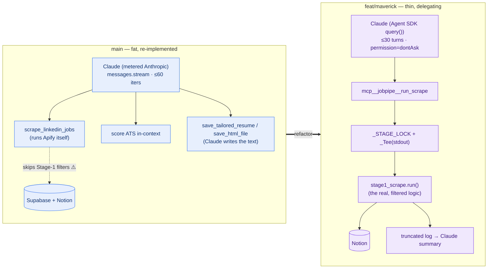
```mermaid
flowchart LR
    subgraph BEFORE["main — fat, re-implemented"]
      direction TB
      C1["Claude (metered Anthropic)<br/>messages.stream · ≤60 iters"]
      C1 --> t1["scrape_linkedin_jobs<br/>(runs Apify itself)"]
      C1 --> t2["score ATS in-context"]
      C1 --> t3["save_tailored_resume / save_html_file<br/>(Claude writes the text)"]
      t1 -.->|"skips Stage-1 filters ⚠️"| x1[("Supabase + Notion")]
    end
    subgraph AFTER["feat/maverick — thin, delegating"]
      direction TB
      C2["Claude (Agent SDK query())<br/>≤30 turns · permission=dontAsk"]
      C2 --> w1["mcp__jobpipe__run_scrape"]
      w1 --> lock["_STAGE_LOCK + _Tee(stdout)"]
      lock --> stg["stage1_scrape.run()<br/>(the real, filtered logic)"]
      stg --> no[("Notion")]
      stg --> cap["truncated log → Claude summary"]
    end
    BEFORE ==>|"refactor"| AFTER

    classDef old fill:#e7effd,stroke:#2f6fed,color:#12336e;
    classDef new fill:#f0e8fd,stroke:#7b3fe4,color:#3d1a80;
    class C1,t1,t2,t3,x1 old;
    class C2,w1,lock,stg,no,cap new;
```

**Mechanics:** each `_impl_*` is wrapped by `_make_tool` via the SDK `@tool` decorator (`workflow.py:329-340`); blocking impls run in `asyncio.to_thread`; assembled into `create_sdk_mcp_server(name="jobpipe", version="2.0.0")` (`:343-348`). `_Tee` (`:59-81`) rebinds `sys.stdout` process-globally, so `_STAGE_LOCK` (`:87`) serializes stage calls. `ANTHROPIC_API_KEY` is popped at import (`:46`) to force subscription auth.

## B.4 ERD (Notion-only, JD-in-body)

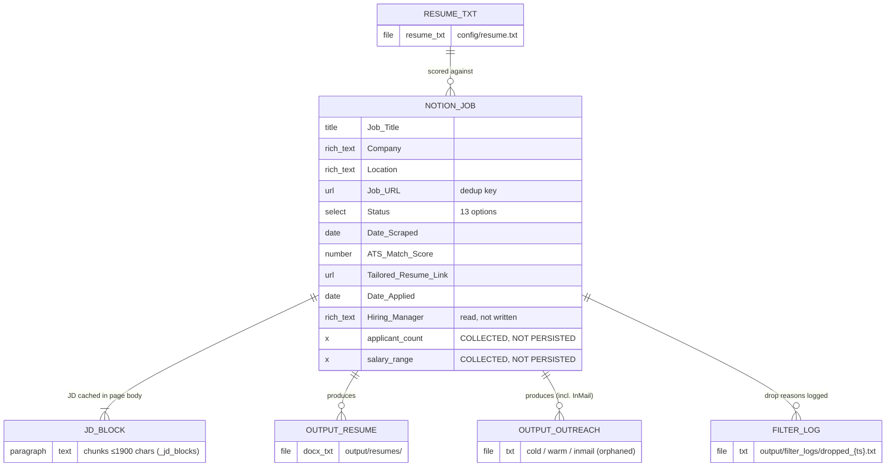
```mermaid
erDiagram
    NOTION_JOB ||--|{ JD_BLOCK : "JD cached in page body"
    NOTION_JOB ||--o{ OUTPUT_RESUME : "produces"
    NOTION_JOB ||--o{ OUTPUT_OUTREACH : "produces (incl. InMail)"
    NOTION_JOB ||--o{ FILTER_LOG : "drop reasons logged"
    RESUME_TXT ||--o{ NOTION_JOB : "scored against"

    NOTION_JOB {
        title Job_Title
        rich_text Company
        rich_text Location
        url Job_URL "dedup key"
        select Status "13 options"
        date Date_Scraped
        number ATS_Match_Score
        url Tailored_Resume_Link
        date Date_Applied
        rich_text Hiring_Manager "read, not written"
        x applicant_count "COLLECTED, NOT PERSISTED"
        x salary_range "COLLECTED, NOT PERSISTED"
    }
    JD_BLOCK {
        paragraph text "chunks ≤1900 chars (_jd_blocks)"
    }
    OUTPUT_RESUME {
        file docx_txt "output/resumes/"
    }
    OUTPUT_OUTREACH {
        file txt "cold / warm / inmail (orphaned)"
    }
    FILTER_LOG {
        file txt "output/filter_logs/dropped_{ts}.txt"
    }
    RESUME_TXT {
        file resume_txt "config/resume.txt"
    }
```

**ERD deltas from `main`:** Supabase is gone; `page_id` everywhere is the Notion page id. The JD is now a **1-to-many `NOTION_JOB → JD_BLOCK`** (paragraph blocks in the page body via `_jd_blocks`, `utils.py:288-295`), read back by `db_get_job_description`. `Status` now has **13 select options** (adds manual-only `Disregard, Blacklist, Archived, Rejected, Human Review`). The live DB also carries `Notes`, `Referral Contact`, `Job ID` — none read/written by any stage. ⚠️ `applicant_count` and `salary_range` are scraped (`stage1:144-145`) and passed to `db_add_job` (`:594-595`) but **`_notion_write_job` has no matching property** → dropped; InMail's `Applicants:`/`Salary:` lines therefore always print `unknown`.

## B.5 Stage-1 data flow (6-layer filter + snapshot dedup + ingest)

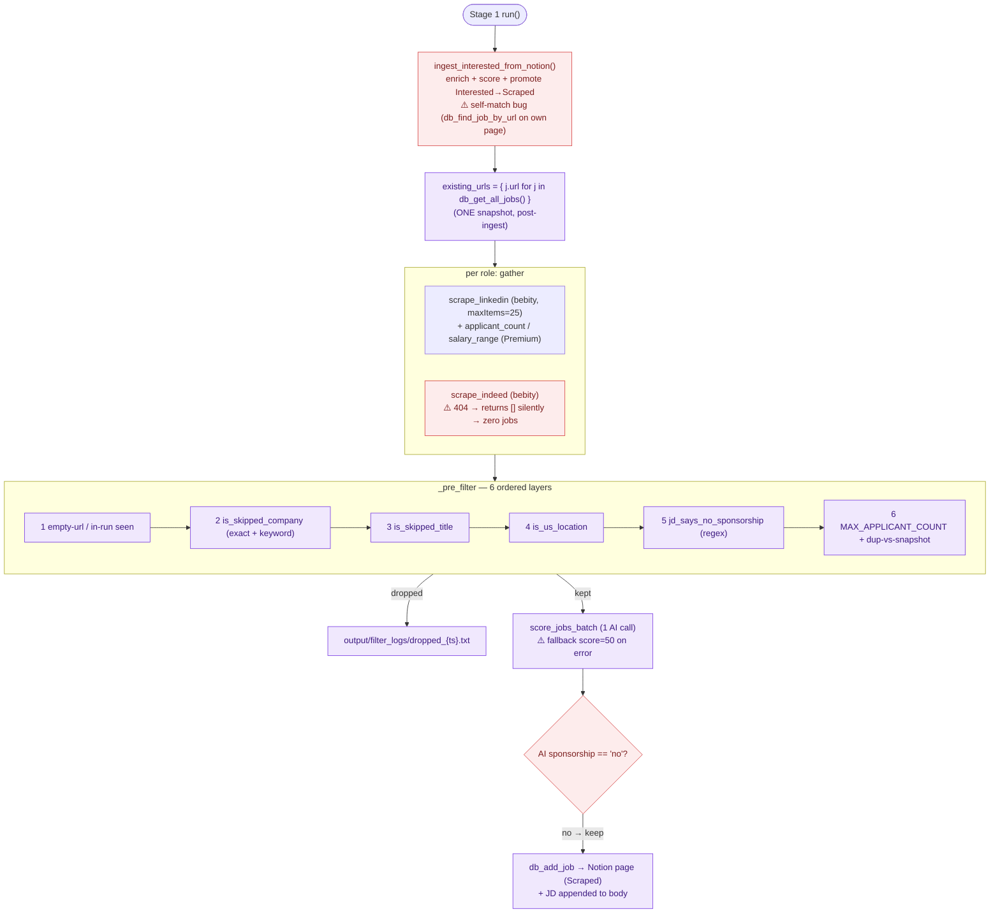
```mermaid
flowchart TD
    START(["Stage 1 run()"]) --> ING["ingest_interested_from_notion()<br/>enrich + score + promote Interested→Scraped<br/>⚠️ self-match bug (db_find_job_by_url on own page)"]
    ING --> SNAP["existing_urls = { j.url for j in db_get_all_jobs() }<br/>(ONE snapshot, post-ingest)"]
    SNAP --> GATHER
    subgraph GATHER["per role: gather"]
      LI["scrape_linkedin (bebity, maxItems=25)<br/>+ applicant_count / salary_range (Premium)"]
      IN["scrape_indeed (bebity)<br/>⚠️ 404 → returns [] silently → zero jobs"]
    end
    GATHER --> PF
    subgraph PF["_pre_filter — 6 ordered layers"]
      f1["1 empty-url / in-run seen"] --> f2["2 is_skipped_company (exact + keyword)"]
      f2 --> f3["3 is_skipped_title"] --> f4["4 is_us_location"]
      f4 --> f5["5 jd_says_no_sponsorship (regex)"] --> f6["6 MAX_APPLICANT_COUNT + dup-vs-snapshot"]
    end
    PF -->|"dropped"| LOG["output/filter_logs/dropped_{ts}.txt"]
    PF -->|"kept"| SCORE["score_jobs_batch (1 AI call)<br/>⚠️ fallback score=50 on error"]
    SCORE --> SPON{"AI sponsorship == 'no'?"}
    SPON -->|"no → keep"| ADD["db_add_job → Notion page (Scraped)<br/>+ JD appended to body"]

    classDef mav fill:#f0e8fd,stroke:#7b3fe4,color:#3d1a80;
    classDef warn fill:#fdecec,stroke:#d64545,color:#7a1d1d;
    class SNAP,f1,f2,f3,f4,f5,f6,SCORE,ADD,LOG mav;
    class ING,IN,SPON warn;
```

## B.6 Provider routing (claude_code vs metered)

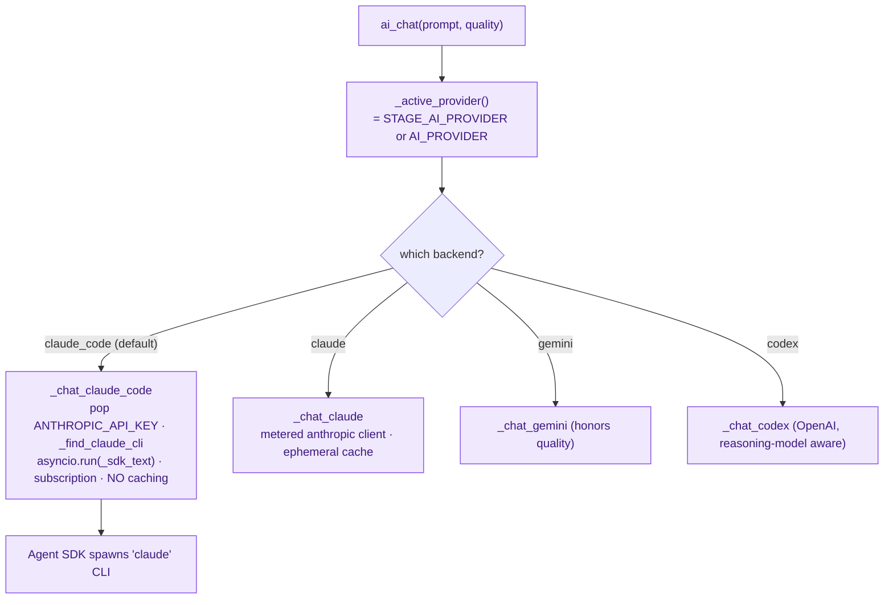
```mermaid
flowchart TD
    CALL["ai_chat(prompt, quality)"] --> AP["_active_provider()<br/>= STAGE_AI_PROVIDER or AI_PROVIDER"]
    AP --> SEL{"which backend?"}
    SEL -->|"claude_code (default)"| CC["_chat_claude_code<br/>pop ANTHROPIC_API_KEY · _find_claude_cli<br/>asyncio.run(_sdk_text) · subscription · NO caching"]
    SEL -->|"claude"| CL["_chat_claude<br/>metered anthropic client · ephemeral cache"]
    SEL -->|"gemini"| GM["_chat_gemini (honors quality)"]
    SEL -->|"codex"| CX["_chat_codex (OpenAI, reasoning-model aware)"]
    CC --> CLI["Agent SDK spawns 'claude' CLI"]

    classDef mav fill:#f0e8fd,stroke:#7b3fe4,color:#3d1a80;
    class CALL,AP,CC,CL,GM,CX,CLI mav;
```

`workflow.py` (the orchestrator) always runs on the subscription via the Agent SDK; `STAGE_AI_PROVIDER` lets the stage scripts it invokes use a *different* provider than the orchestrator.

## B.7 Job status lifecycle (13 options)

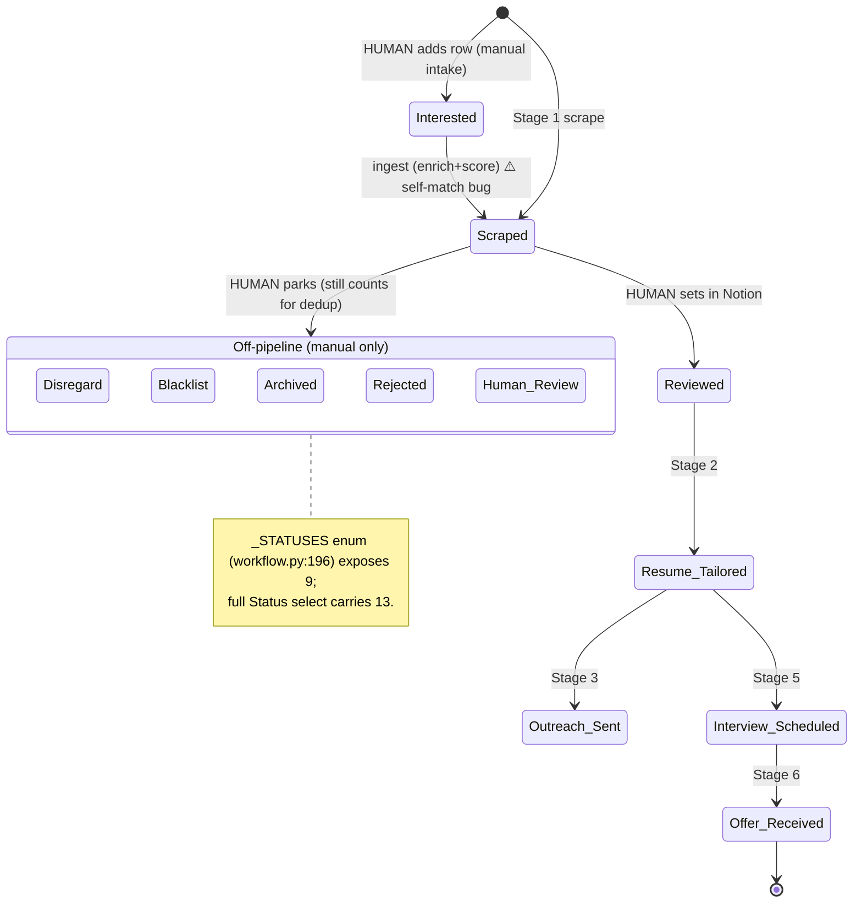
```mermaid
stateDiagram-v2
    [*] --> Interested: HUMAN adds row (manual intake)
    Interested --> Scraped: ingest (enrich+score) ⚠️ self-match bug
    [*] --> Scraped: Stage 1 scrape
    Scraped --> Reviewed: HUMAN sets in Notion
    Reviewed --> Resume_Tailored: Stage 2
    Resume_Tailored --> Outreach_Sent: Stage 3
    Resume_Tailored --> Interview_Scheduled: Stage 5
    Interview_Scheduled --> Offer_Received: Stage 6
    Offer_Received --> [*]
    state "Off-pipeline (manual only)" as OFF {
      Disregard
      Blacklist
      Archived
      Rejected
      Human_Review
    }
    Scraped --> OFF: HUMAN parks (still counts for dedup)
    note right of OFF
      _STATUSES enum (workflow.py:196) exposes 9;
      full Status select carries 13.
    end note
```

## B.8 Notable maverick risks (cited)

| # | Risk | Location | Effect |
|---|---|---|---|
| M1 | Indeed actor `bebity~indeed-scraper` 404s; exception swallowed | `stage1:38,166-170` | Indeed has contributed **zero** listings for the project's life |
| M2 | LinkedIn payload/actor mismatch (`queries`/`timePosted`/`cookie` = curious_coder fields sent to bebity constant) | `stage1:36` vs `:79-92` | LinkedIn result volume **unverified** |
| M3 | "Interested" intake self-matches its own page | `stage1:397` → `utils.py:454` | Promotes to `Scraped` with no score, no cached JD |
| M4 | `applicant_count` / `salary_range` collected but never persisted | `stage1:144-145,594-595` vs `utils.py:307-317` | Premium filter inert; InMail prints `unknown` |
| M5 | `run_inmail` reachable only via a raw `--inmail` CLI flag | `stage3:375-376` | Entire InMail feature unreachable from `run.py`/`workflow.py` |
| M6 | `APIFY_API_TOKEN` plaintext literal (in git history) | `settings.py:142` | Credential exposure |
| M7 | `_Tee` rebinds global stdout → forces serial stage execution | `workflow.py:87` | Concurrency ceiling (by design) |

---

# C. Proposed future — `refinement-plans/` 

> Five plan documents propose changes to the **same four functions** (sourcing, filtering, reliability, communications). None are implemented. The `refinement-plans/README.md` already resolves their overlaps into a strict `Step 0 → 7` execution spine with eight named conflicts (C1–C8), reproduced as a DAG in §C.7.

## C.1 The five plans at a glance

| # | Plan | New modules / files | New Notion | New vendor | Cost Δ/mo |
|---|---|---|---|---|---|
| 1 | **Filtering rework** | *(edits only)* | `Sponsorship` | — | $0 |
| 2 | **Reliability / hybrid-agentic** | *(edits only)* | `Scoring Attempts`, `Retry` status | metered `ANTHROPIC_API_KEY` | +$3–5 |
| 3 | **Sourcing research** *(analysis, not a spec)* | — | — | `valig`, `misceres`, JobSpy (candidates) | **−$29.99** |
| 4 | **Multi-source sourcing** | `scripts/sources.py`, `config/ats_tokens.json` | `Posted Date`, `Source`, `Applicant Count`, `Salary Range` | Greenhouse/Lever/Ashby (free) → Glassdoor/Wellfound (Phase 2) | $0 → +$15 |
| 5 | **Communications subsystem** | `scripts/credits.py`, `stage7_leads_discover.py`, `stage8_email_resolve.py`, `config/company_domains.json`, `.github/workflows/communications.yml` | **new Leads DB (~22 props)** | Hunter.io, Apify `coregent`, GitHub Actions | ~+$0.02 → +$9 |

## C.2 Target-state component architecture

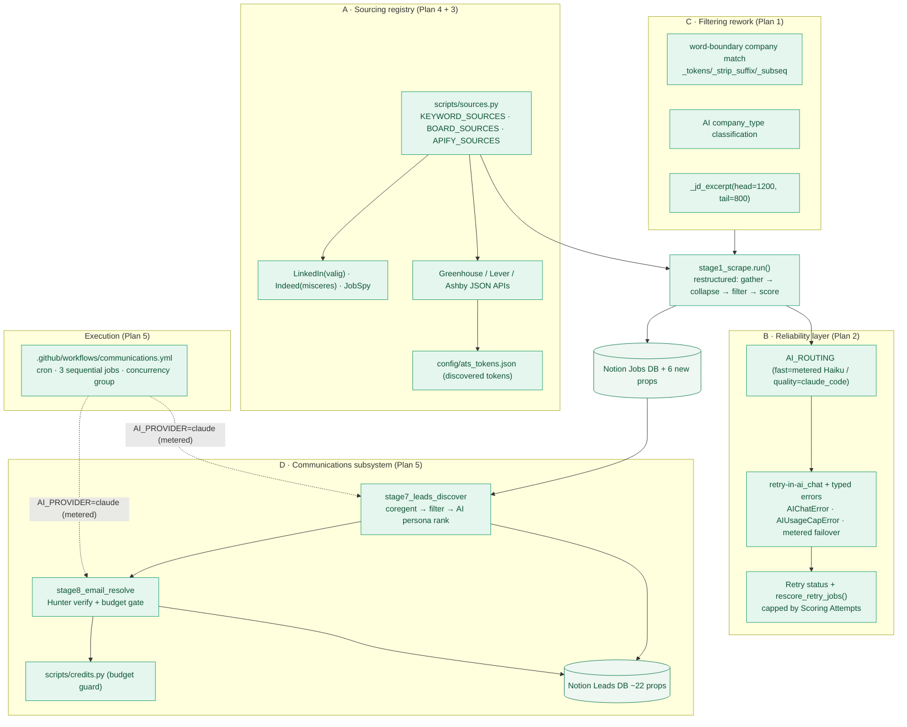
```mermaid
flowchart TB
    subgraph SRC["A · Sourcing registry (Plan 4 + 3)"]
      REG["scripts/sources.py<br/>KEYWORD_SOURCES · BOARD_SOURCES · APIFY_SOURCES"]
      KW["LinkedIn(valig) · Indeed(misceres) · JobSpy"]
      BRD["Greenhouse / Lever / Ashby JSON APIs"]
      TOK["config/ats_tokens.json (discovered tokens)"]
    end
    subgraph REL["B · Reliability layer (Plan 2)"]
      RT["AI_ROUTING (fast=metered Haiku / quality=claude_code)"]
      RETRY["retry-in-ai_chat + typed errors<br/>AIChatError · AIUsageCapError · metered failover"]
      RQ["Retry status + rescore_retry_jobs()<br/>capped by Scoring Attempts"]
    end
    subgraph FIL["C · Filtering rework (Plan 1)"]
      WB["word-boundary company match<br/>_tokens/_strip_suffix/_subseq"]
      CT["AI company_type classification"]
      EX["_jd_excerpt(head=1200, tail=800)"]
    end
    subgraph COM["D · Communications subsystem (Plan 5)"]
      S7["stage7_leads_discover<br/>coregent → filter → AI persona rank"]
      S8["stage8_email_resolve<br/>Hunter verify + budget gate"]
      CR["scripts/credits.py (budget guard)"]
      LEADS[("Notion Leads DB ~22 props")]
    end
    subgraph CI["Execution (Plan 5)"]
      GHA[".github/workflows/communications.yml<br/>cron · 3 sequential jobs · concurrency group"]
    end
    STAGE1["stage1_scrape.run()<br/>restructured: gather → collapse → filter → score"]
    JOBS[("Notion Jobs DB + 6 new props")]

    REG --> KW & BRD
    BRD --> TOK
    REG --> STAGE1
    RT --> RETRY --> RQ
    STAGE1 --> RT
    FIL --> STAGE1
    STAGE1 --> JOBS
    JOBS --> S7 --> S8
    S8 --> CR
    S7 --> LEADS
    S8 --> LEADS
    GHA -.->|"AI_PROVIDER=claude (metered)"| S7 & S8

    classDef fut fill:#e5f6ee,stroke:#1f9d6b,color:#0d5236;
    classDef store fill:#eef7f1,stroke:#137a52,color:#0d5236;
    class REG,KW,BRD,TOK,RT,RETRY,RQ,WB,CT,EX,S7,S8,CR,GHA,STAGE1 fut;
    class LEADS,JOBS store;
```

## C.3 Future ERD (extended Jobs DB + new Leads DB)

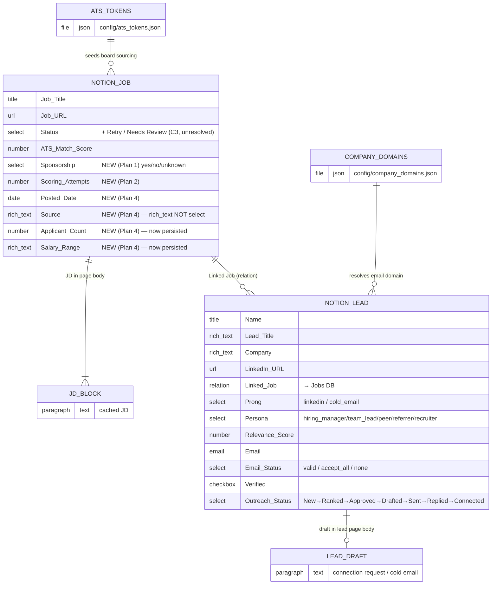
```mermaid
erDiagram
    NOTION_JOB ||--|{ JD_BLOCK : "JD in page body"
    NOTION_JOB ||--o{ NOTION_LEAD : "Linked Job (relation)"
    NOTION_LEAD ||--o| LEAD_DRAFT : "draft in lead page body"
    ATS_TOKENS ||--o{ NOTION_JOB : "seeds board sourcing"
    COMPANY_DOMAINS ||--o{ NOTION_LEAD : "resolves email domain"

    NOTION_JOB {
        title Job_Title
        url Job_URL
        select Status "+ Retry / Needs Review (C3, unresolved)"
        number ATS_Match_Score
        select Sponsorship "NEW (Plan 1) yes/no/unknown"
        number Scoring_Attempts "NEW (Plan 2)"
        date Posted_Date "NEW (Plan 4)"
        rich_text Source "NEW (Plan 4) — rich_text NOT select"
        number Applicant_Count "NEW (Plan 4) — now persisted"
        rich_text Salary_Range "NEW (Plan 4) — now persisted"
    }
    NOTION_LEAD {
        title Name
        rich_text Lead_Title
        rich_text Company
        url LinkedIn_URL
        relation Linked_Job "→ Jobs DB"
        select Prong "linkedin / cold_email"
        select Persona "hiring_manager/team_lead/peer/referrer/recruiter"
        number Relevance_Score
        email Email
        select Email_Status "valid / accept_all / none"
        checkbox Verified
        select Outreach_Status "New→Ranked→Approved→Drafted→Sent→Replied→Connected"
    }
    JD_BLOCK { paragraph text "cached JD" }
    LEAD_DRAFT { paragraph text "connection request / cold email" }
    ATS_TOKENS { file json "config/ats_tokens.json" }
    COMPANY_DOMAINS { file json "config/company_domains.json" }
```

**ERD notes.** Six new Jobs-DB properties land in **one batched migration** (Step 2) *before* any writer code, so a schema mismatch never causes a silent zero-row outage. `Source` is **rich_text, not select** — an un-pre-created select option throws on write, and the bare `except` would turn that into a silent scrape failure. The **Leads DB** (~22 props) is a new Notion database joined to Jobs via a Notion **relation** (`Linked Job`, many leads → one job). `Applicant Count` / `Salary Range` finally get a home (they are already collected on `feat/maverick`, see M4). Corrections the plans must honor: **`ANTHROPIC_API_KEY` is absent from `settings.py`** and must be *added* env-sourced (not "moved"); the C3 status name must also land in **`workflow.py:196 _STATUSES`**.

## C.4 Future Stage-1 flow (global gather → collapse → filter → score)

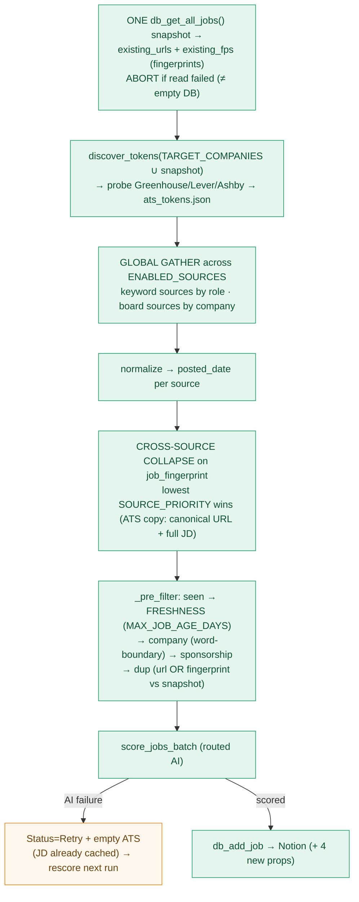
```mermaid
flowchart TD
    A["ONE db_get_all_jobs() snapshot →<br/>existing_urls + existing_fps (fingerprints)<br/>ABORT if read failed (≠ empty DB)"] --> B["discover_tokens(TARGET_COMPANIES ∪ snapshot)<br/>→ probe Greenhouse/Lever/Ashby → ats_tokens.json"]
    B --> C["GLOBAL GATHER across ENABLED_SOURCES<br/>keyword sources by role · board sources by company"]
    C --> D["normalize → posted_date per source"]
    D --> E["CROSS-SOURCE COLLAPSE on job_fingerprint<br/>lowest SOURCE_PRIORITY wins (ATS copy: canonical URL + full JD)"]
    E --> F["_pre_filter: seen → FRESHNESS (MAX_JOB_AGE_DAYS)<br/>→ company (word-boundary) → sponsorship<br/>→ dup (url OR fingerprint vs snapshot)"]
    F --> G["score_jobs_batch (routed AI)"]
    G -->|"AI failure"| R["Status=Retry + empty ATS<br/>(JD already cached) → rescore next run"]
    G -->|"scored"| H["db_add_job → Notion (+ 4 new props)"]

    classDef fut fill:#e5f6ee,stroke:#1f9d6b,color:#0d5236;
    classDef warn fill:#fff7ec,stroke:#e08a1e,color:#6b4410;
    class A,B,C,D,E,F,G,H fut;
    class R warn;
```

## C.5 Reliability retry / failover flow (Plan 2)

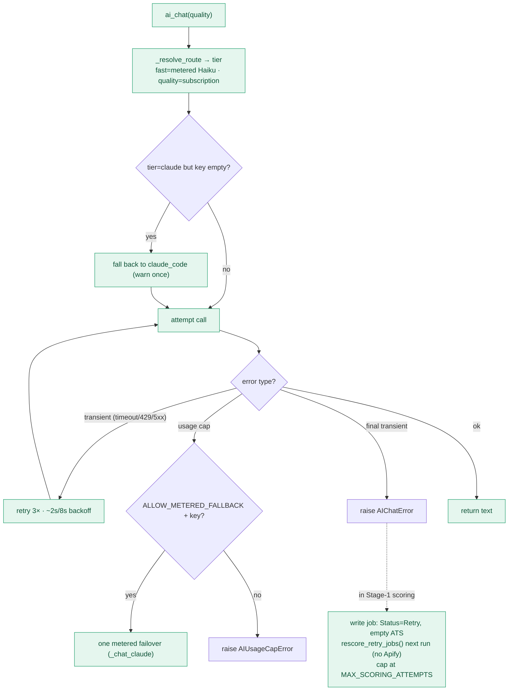
```mermaid
flowchart TD
    CALL["ai_chat(quality)"] --> ROUTE["_resolve_route → tier<br/>fast=metered Haiku · quality=subscription"]
    ROUTE --> KEY{"tier=claude but key empty?"}
    KEY -->|"yes"| FB["fall back to claude_code (warn once)"]
    KEY -->|"no"| TRY["attempt call"]
    FB --> TRY
    TRY --> ERR{"error type?"}
    ERR -->|"transient (timeout/429/5xx)"| RETRY["retry 3× · ~2s/8s backoff"]
    RETRY --> TRY
    ERR -->|"usage cap"| CAP{"ALLOW_METERED_FALLBACK + key?"}
    CAP -->|"yes"| MET["one metered failover (_chat_claude)"]
    CAP -->|"no"| RAISE1["raise AIUsageCapError"]
    ERR -->|"final transient"| RAISE2["raise AIChatError"]
    ERR -->|"ok"| OK["return text"]
    RAISE2 -.->|"in Stage-1 scoring"| RQ["write job: Status=Retry, empty ATS<br/>rescore_retry_jobs() next run (no Apify)<br/>cap at MAX_SCORING_ATTEMPTS"]

    classDef fut fill:#e5f6ee,stroke:#1f9d6b,color:#0d5236;
    class CALL,ROUTE,FB,TRY,RETRY,MET,OK,RQ fut;
```

## C.6 Communications Stages 7–8 flow (with human gate)

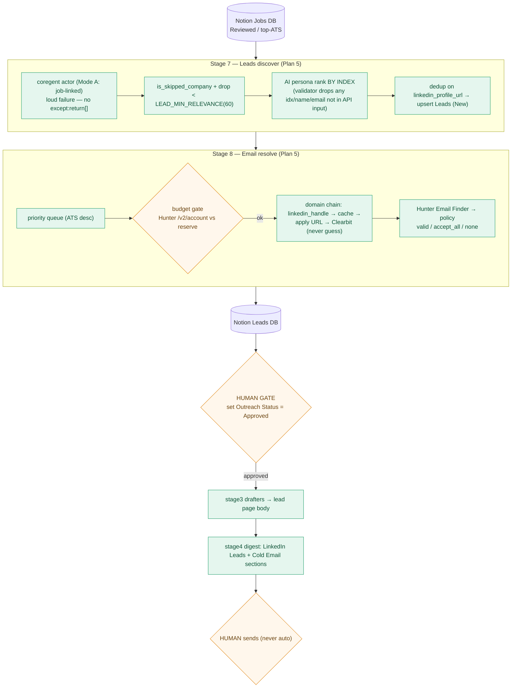
```mermaid
flowchart TD
    J[("Notion Jobs DB<br/>Reviewed / top-ATS")] --> S7
    subgraph S7["Stage 7 — Leads discover (Plan 5)"]
      A["coregent actor (Mode A: job-linked)<br/>loud failure — no except:return[]"] --> B["is_skipped_company + drop < LEAD_MIN_RELEVANCE(60)"]
      B --> C["AI persona rank BY INDEX<br/>(validator drops any idx/name/email not in API input)"]
      C --> D["dedup on linkedin_profile_url → upsert Leads (New)"]
    end
    S7 --> S8
    subgraph S8["Stage 8 — Email resolve (Plan 5)"]
      E["priority queue (ATS desc)"] --> F{"budget gate<br/>Hunter /v2/account vs reserve"}
      F -->|"ok"| G["domain chain: linkedin_handle → cache →<br/>apply URL → Clearbit (never guess)"]
      G --> H["Hunter Email Finder → policy<br/>valid / accept_all / none"]
    end
    S8 --> LEADS[("Notion Leads DB")]
    LEADS --> GATE{"HUMAN GATE<br/>set Outreach Status = Approved"}
    GATE -->|"approved"| DRAFT["stage3 drafters → lead page body"]
    DRAFT --> DIG["stage4 digest: LinkedIn Leads + Cold Email sections"]
    DIG --> SEND{"HUMAN sends (never auto)"}

    classDef fut fill:#e5f6ee,stroke:#1f9d6b,color:#0d5236;
    classDef gate fill:#fff7ec,stroke:#e08a1e,color:#6b4410;
    class A,B,C,D,E,G,H,DRAFT,DIG fut;
    class F,GATE,SEND gate;
    class J,LEADS store;
```

**Governing rule (Plan 5):** *"APIs supply facts; AI ranks and writes."* The AI never invents a name, title, email, or domain — a code validator drops any AI output not present in the API input set. On GitHub Actions the filesystem is ephemeral, so drafts are written to the **Notion lead page body** (artifacts are a secondary copy), and a proposed SQLite credit ledger is **rejected** in favor of Hunter's free `/v2/account` as real-time truth plus a `concurrency:` group for mutual exclusion.

## C.7 Roadmap — dependency DAG (Step 0 → 7, conflicts C1–C8)

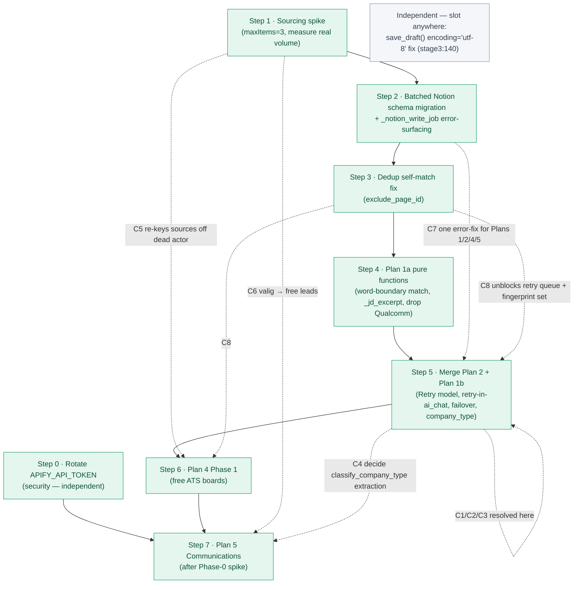
```mermaid
flowchart TD
    S0["Step 0 · Rotate APIFY_API_TOKEN<br/>(security — independent)"]
    S1["Step 1 · Sourcing spike<br/>(maxItems=3, measure real volume)"]
    S2["Step 2 · Batched Notion schema migration<br/>+ _notion_write_job error-surfacing"]
    S3["Step 3 · Dedup self-match fix<br/>(exclude_page_id)"]
    S4["Step 4 · Plan 1a pure functions<br/>(word-boundary match, _jd_excerpt, drop Qualcomm)"]
    S5["Step 5 · Merge Plan 2 + Plan 1b<br/>(Retry model, retry-in-ai_chat, failover, company_type)"]
    S6["Step 6 · Plan 4 Phase 1<br/>(free ATS boards)"]
    S7["Step 7 · Plan 5 Communications<br/>(after Phase-0 spike)"]

    S0 --> S7
    S1 --> S2 --> S3 --> S4 --> S5 --> S6 --> S7
    S1 -. "C5 re-keys sources off dead actor" .-> S6
    S1 -. "C6 valig → free leads" .-> S7
    S2 -. "C7 one error-fix for Plans 1/2/4/5" .-> S5
    S3 -. "C8 unblocks retry queue + fingerprint set" .-> S5
    S3 -. C8 .-> S6
    S5 -. "C1/C2/C3 resolved here" .-> S5
    S5 -. "C4 decide classify_company_type extraction" .-> S7

    IND["Independent — slot anywhere:<br/>save_draft() encoding='utf-8' fix (stage3:140)"]

    classDef sec fill:#e5f6ee,stroke:#1f9d6b,color:#0d5236;
    classDef ind fill:#f4f6fa,stroke:#8a97a8,color:#33404f;
    class S0,S1,S2,S3,S4,S5,S6,S7 sec;
    class IND ind;
```

**Conflict legend.** **C1** Plans 1 & 2 both rewrite `score_jobs_batch()` incompatibly → merge (Plan 2's failure model wins). **C2** Plan 2's in-`ai_chat` retry supersedes Plan 1's wrapper. **C3** three names for one status (`Retry` / `Needs Review` / reuse `Human Review`) — pick one, add to `_STATUSES`. **C4** Plan 5 needs a standalone `classify_company_type()`; Plan 1 declines to extract it. **C5** Plan 4 is keyed on the dead Indeed actor Plan 3 identifies. **C6** Plan 3's `valig` swap gives Plan 5 free recruiter leads. **C7** `_notion_write_job()` is touched by four plans — land the error-surfacing fix once. **C8** the dedup self-match bug blocks both Plan 2's retry queue and Plan 4's fingerprint set.

## C.8 Roadmap — project timeline (Gantt / PM view)

```mermaid
gantt
    title Refinement execution order (relative sequencing, not calendar-committed)
    dateFormat YYYY-MM-DD
    axisFormat %b %d
    section Security
    Step 0 Rotate APIFY token           :crit, s0, 2026-07-14, 1d
    section De-risk & foundations
    Step 1 Sourcing spike               :s1, after s0, 3d
    Step 2 Batched schema migration     :s2, after s1, 2d
    Step 3 Dedup self-match fix         :s3, after s2, 1d
    section User-visible features
    Step 4 Plan 1a pure functions       :s4, after s3, 2d
    Step 5 Merge Plan 2 + 1b            :s5, after s4, 5d
    section Sourcing breadth
    Step 6 Plan 4 Phase 1 (ATS boards)  :s6, after s5, 4d
    section Communications
    Step 7 Plan 5 Phase-0 spike         :crit, s7a, after s6, 3d
    Step 7 Plan 5 build (Stages 7-8+CI) :s7b, after s7a, 8d
```

> Durations are **relative effort placeholders** to convey sequence and phase, not committed calendar estimates.

## C.9 Complexity & cost summary

| Rank | Plan | Complexity driver |
|---|---|---|
| 1 (most) | **5 · Communications** | 2 new stages, new DB (~22 props), `credits.py`, digest refactor, 2 vendors, new CI execution model, GDPR/gate/budget, blocking Phase-0 spike |
| 2 | **4 · Multi-source** | new `sources.py`, two registries, `run()` restructure, slug-collision risk, 4 props, Phase-2 spend/ToS |
| 3 | **2 · Reliability** | 5 files; tiering + typed errors + failover + capped retry queue; holds the blocking §3.5 bug |
| 4 | **1 · Filtering** | confined to Stage 1 + helpers; core is pure functions; only hazard is C1 |
| 5 (least) | **3 · Sourcing** | research doc; actionable core = 2 constants + 2 payload builders — de-risks the most other work |

| Change | Δ / month |
|---|---|
| Drop `bebity` LinkedIn rental (Step 1 / Plan 3) | **−$29.99** |
| `valig` LinkedIn + `misceres` Indeed at current volume | ~+$0.50 |
| Plan 2 fast tier → metered Haiku | +$3–5 |
| Plan 4 Phase 1 (ATS boards) | $0 |
| Plan 4 Phase 2 (four Apify sources, daily) | +$15 |
| Plan 5 (Hunter free tier; Apify Mode A / Mode B) | ~+$0.02 / +$9 |
| **Net through Steps 0–5** | **cheaper than today** |

---

# D. Cross-cutting synthesis 

## D.1 Consolidated risk register

Severity: 🔴 high (silent data/credential loss) · 🟠 medium (feature broken/misleading) · 🟡 low (hygiene).

| ID | Sev | Risk | Present on | Location | Resolved by |
|---|---|---|---|---|---|
| R1 | 🔴 | `APIFY_API_TOKEN` plaintext in VCS/history | main, maverick | `settings.py:142` | Step 0 (rotate + env) |
| R2 | 🔴 | Committed secrets (Anthropic/OpenAI/Supabase service_role) | main | `settings.py:62-73` | rotate all; env-source |
| R3 | 🔴 | AI scoring failure fabricates `score=50` silently | main, maverick | `stage1:375,381` | Step 5 (Retry model) |
| R4 | 🔴 | `_notion_write_job` bare `except` → schema mismatch = silent zero-row run | maverick | `utils.py:319-320` | Step 2 (error-surfacing) |
| R5 | 🟠 | Indeed actor 404 → zero listings, swallowed | maverick | `stage1:38,166-170` | Step 1 spike / Plan 3 swap |
| R6 | 🟠 | LinkedIn payload/actor mismatch → volume unverified | maverick | `stage1:36` vs `:79-92` | Step 1 spike |
| R7 | 🟠 | "Interested" intake self-match → no score/JD | maverick | `stage1:397` | Step 3 (`exclude_page_id`) |
| R8 | 🟠 | `applicant_count`/`salary_range` collected, never persisted | maverick | `stage1:594-595` | Step 2/Plan 4 (add props) |
| R9 | 🟠 | `run_inmail` orphaned (unreachable from entry points) | maverick | `stage3:375-376` | wire into `run.py`/`workflow.py` |
| R10 | 🟠 | Stage 6 `UnboundLocalError` on every run | main | `stage6:125` vs `:135` | (fix — not yet planned) |
| R11 | 🟠 | Denylist substring match eats real companies (`UST`→c**ust**omer.io) | maverick | `stage1:274` | Step 4 (word-boundary) |
| R12 | 🟡 | `date_applied` divergence between entry points | main | `workflow.py:171` vs `utils.py:310` | reconcile writers |
| R13 | 🟡 | Stage 5 asks LLM to "fetch" an inaccessible URL | main, maverick | `stage5:141,146` | pass JD explicitly |
| R14 | 🟡 | `save_draft()` non-UTF-8 → Windows cp1252 crash on real names | maverick | `stage3:140` | independent one-liner |
| R15 | 🟡 | `_STATUSES` won't include the new status | future gap | `workflow.py:196` | Step 5 (add to enum) |

## D.2 Open questions (decisions that change the plans)

| # | Question | Why it matters |
|---|---|---|
| Q1 | **Status name** — `Retry`, `Needs Review`, or reuse `Human Review`? (C3) | One name must be picked *and* added to `_STATUSES`; blocks Plans 1 & 2 landing cleanly |
| Q2 | **JobSpy vs. Apify** for sourcing? (C5) | Step-1 spike resolves it; `valig`+`misceres` is the smallest diff and hands Plan 5 free leads |
| Q3 | **Extract `classify_company_type()`** standalone? (C4) | Plan 5 reuses it; Plan 1 currently declines — fund it or fall back to `is_skipped_company()` |
| Q4 | **Keep Indeed at all?** | Zero listings for the project's life — fix or drop from `ENABLED_SOURCES` |
| Q5 | **Plan 4 Phase 2 ToS posture** (Glassdoor/Wellfound scraping) | Legal/ToS exposure; may stop at the three free ATS boards |
| Q6 | **Adopt GitHub Actions** (Plan 5)? | CI runs bill metered tokens and cannot use the subscription |
| Q7 | **`Sponsorship` semantics** — surface `unknown`? | The regex only catches *explicit* denials, so `unknown` is the majority |

## D.3 Recommendations

1. **Do Step 0 now, regardless of roadmap.** R1/R2 are live credential exposures independent of every feature. Rotate and move to `os.environ`.
2. **Run the Step-1 sourcing spike before tuning anything.** Four plans (1, 2, 4, and the baseline itself) tune filters/dedup/scoring against a LinkedIn+Indeed volume **nobody has measured** — Indeed is silently zero and LinkedIn is unverified. A few hours here de-risks the most work.
3. **Land the schema migration + error-surfacing fix as one pass (Step 2).** It removes the individually-risky "add a Notion property" step from Plans 1/2/4 and converts the scariest failure mode (silent zero-row scrape) into a diagnosable error.
4. **Fix the two blocking bugs early (Steps 3 + the Stage-6 `UnboundLocalError`, R10).** They are cheap and unblock downstream work / a whole stage.
5. **Treat the plans as the sequenced spine they already are** (`0→1→2→3→4→5→6→7`), not as parallel tracks — the eight conflicts mean landing them out of order means writing the same code twice.
6. **Reconcile the two entry points.** The agentic path skipping Stage-1 filters (B3) and the `date_applied` divergence (B2/R12) mean `run.py` and `workflow.py` can produce different results for the "same" task — the thin-wrapper refactor mostly fixed this; finish it.

---

## Appendix — source map & method

**Method.** Three parallel agent deep-reads: (1) the `main` worktree (baseline), (2) `feat/maverick` vs `main` via `git diff`/`git show` (delta), (3) the five `refinement-plans/` docs spot-checked against live source (future). Every structural claim is traced to `file:line`; conflicting or unmeasured items are labelled as such rather than asserted.

**Primary files referenced.**

| Area | Files |
|---|---|
| Entry points | `run.py`, `workflow.py` |
| Stages | `scripts/stage1_scrape.py` … `stage6_negotiate.py` |
| Data + AI layer | `scripts/utils.py`, `scripts/render_docx.py` |
| Config | `config/settings.py` |
| Future specs | `refinement-plans/README.md`, `filtering/…`, `reliability/…`, `sourcing/…`, `communications/…` |

**Legend recap:** 🟦 `main` · 🟪 `feat/maverick` · 🟩 `refinement-plans`. Cylinders = datastores; diamonds = gates/decisions; ⚠️ = cited defect.

*End of document.*
