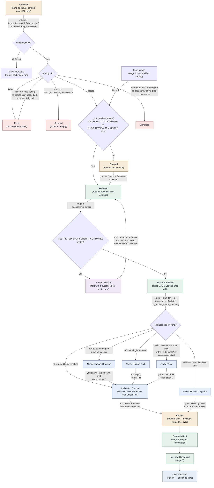

# Jobs Tracker Status Flow

Every value the Notion `Status` select can hold, in the order a job actually travels through
them, and exactly which stage script (or human) moves it between them. Verified against
`scripts/stage1_scrape.py`, `scripts/stage2_tailor.py`, `scripts/autoapply.py`, and
`scripts/provision_notion.py` on `feature/step-10-auto-apply` — this now includes the Stage 7
(auto-apply) branch, which the previous version of this doc predated entirely.

## Pipeline

## Stage-by-stage notes

| Status | Who writes it | Notes |
|---|---|---|
| **Interested** | hand, or scratch-note ingest | Entry point. Just Job Title / Company / Job URL — everything else fills in on ingest. |
| **Retry** | stage 1 | JD enriched and cached, but the AI scoring call failed or dropped the URL. `Scoring Attempts` increments each pass; `rescore_retry_jobs()` retries from the cached JD (no repeat Apify call) at the top of every stage 1 run. Past `MAX_SCORING_ATTEMPTS`, gives up and lands in `Scraped` with an empty score. |
| **Scraped** | stage 1 | Landing spot for anything that doesn't clear the auto-review gate (sponsorship explicitly `no`, or score < `AUTO_REVIEW_MIN_SCORE`). Held for a human second look — flip to `Reviewed` by hand when it's worth applying to. |
| **Reviewed** | stage 1 (auto), or hand from `Scraped` | `_auto_review_status(sponsorship, score)` fires identically for a fresh scrape, a recovered `Interested` job, and a recovered `Retry` job — silence on sponsorship is *not* treated as a red flag, only an explicit "no" or a low score keeps the gate closed. This is what `--evaluate` reads. |
| **Human Review** | stage 2 | `_sponsorship_gate()` — `RESTRICTED_SPONSORSHIP_COMPANIES` (Notion DB ∪ hardcoded fallback) match, company is known to sponsor only existing employees. Held with a guidance note instead of tailoring. Release by confirming sponsorship yourself, adding `SPONSORSHIP_CONFIRMED_MARKER` to Notes, and moving back to `Reviewed`. |
| **Resume Tailored** | stage 2 | Keyword-edited `.docx` saved to `output/resumes/`. Post-tailor ATS score is verified and logged; a low score only warns — it doesn't block or retry. |
| **Application Queued** | stage 7 | `plan_for_job()`'s `readiness_report()` resolved every required field. An HTML answer sheet is written to `APPLICATIONS_DIR`; the form itself is only pre-filled if you passed `--fill`, and even then Stage 7 stops before Submit. |
| **Needs Human: Question** | stage 7 | A required field couldn't be resolved by file-upload/name-map/label-rule/preset — free text always routes here, by design, rather than being AI-guessed. `Needs Human Reason` lists the blocking labels. Answer it yourself (in the profile or by hand) and re-run stage 7. |
| **Needs Human: Captcha** | stage 7 (`--fill` only) | A bounded browser wait stalled rather than erroring — classified as a probable Turnstile-class challenge and handed off rather than retried. Solve it by hand in the pre-filled browser, then submit yourself. |
| **Needs Human: Auth** | stage 7 (`--fill` only) | The live form hit a login/auth wall the browser layer can't clear. Log in yourself, then re-run `--fill`. |
| **Apply Failed** | stage 7 | A fill resolved under `MIN_RESOLVE_RATIO` of planned fields (aborted as `drift` rather than trusting a half-filled form), a PDF-only upload's LibreOffice conversion failed, or Notion silently rejected the status write. Fix the cause and re-run — the job is idempotently re-planned. |
| **Applied** | *nobody* | Purely manual — mark it once you've actually submitted the application. No stage touches this status, on purpose: `WRITABLE_STATUSES` in `scripts/autoapply.py` excludes it, and a test asserts no code path can write it. |
| **Outreach Sent** | stage 3 | Drafts are written to `output/outreach/` first; status only flips once you confirm the email actually went out. |
| **Interview Scheduled** | stage 5 | Set when you generate an interview prep guide for that company/role. |
| **Offer Received** | stage 6 | End of pipeline — set after stage 6 drafts the negotiation brief. |

## Off-pipeline states

Select options on the same field that sit outside the flow above. All are set by hand except
`Disregard`, which stage 1 also writes automatically when a recovered `Retry` job's score fails a
drop gate (no-sponsor / staffing-type / low-score). Any row parked in one of these is simply never
picked up again — `db_get_jobs()` filters on exact status — except dedup, which checks every row
regardless of status.

| Status | Set by | Meaning |
|---|---|---|
| **Disregard** | hand, or stage 1 auto (Retry recovery that fails a drop gate) | Filtered out, won't resurface. |
| **Blacklist** | hand | Company you never want surfaced again. |
| **Archived** | hand | Manually shelved, no longer active. |
| **Rejected** | hand | Outcome recorded after the fact. |
| **Needs Review** | *nobody, currently* | Provisioned as a select option (`provision_notion.py`) but no stage writes or reads it today — reserved for a future manual-flag use case. |
| **Applying** | *nobody, currently* | Provisioned alongside the other Stage 7 options for the in-progress-fill state its name implies, but `autoapply.py` never actually sets it — a fill either completes (no status change beyond `Application Queued`) or diverts to one of the `Needs Human: *` / `Apply Failed` states above. |

## Legend

- **Auto** — written by a stage script without human input, once the gate condition is met.
- **Manual** — written or moved by hand in Notion.
- **Retry / drop** — the retry loop, or a filtered exit from it.
- **Apply** — Stage 7's auto-apply states; every one of them stops short of `Applied`.
- **Off-pipeline** — a parked state a normal stage read never revisits.
- **Terminal** — end of the pipeline.
